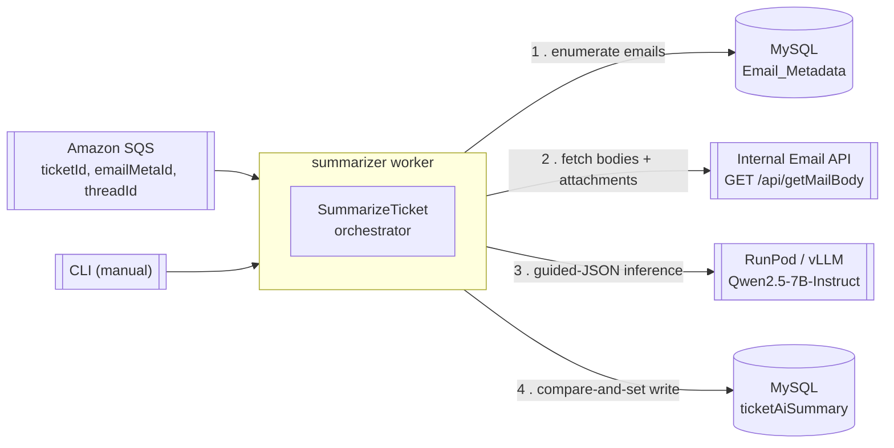

# Stepping Desk — AI Email Summarization Worker (Phase 1)

Reverse-engineered engineering documentation for the `summarizer` service.

> **What this is:** a headless, event-driven Python worker that reads an enterprise
> support ticket's full email thread, summarizes it with a self-hosted LLM, and writes a
> structured summary back to MySQL. It has **no user interface, no HTTP server, and no
> public API** — it is a backend pipeline triggered by Amazon SQS (and, for manual runs, a
> CLI). See [§ A note on scope](#a-note-on-scope) below.

---

## Documentation index

| Doc | Covers (mapped to the 27 requested sections) |
|-----|----------------------------------------------|
| **[01 — Overview](docs/01-overview.md)** | 1 Executive Summary · Business domain · Primary users · Core workflows · 26 Glossary |
| **[02 — Architecture](docs/02-architecture.md)** | 2 High-Level Architecture · 4 Folder Structure · 5 Application Architecture · 21 Design Patterns · dependency & module graphs |
| **[03 — Pipeline & Data Flow](docs/03-pipeline-and-data-flow.md)** | 6 Routing (event dispatch) · 8 State Management (the CAS frontier) · 11 Data Flow · 12 Component Architecture · request/event lifecycle |
| **[04 — Backend Internals](docs/04-backend.md)** | 5 Backend architecture · 13 Services/utilities · 17 Error Handling · logging & observability · concurrency model |
| **[05 — Interfaces & Integrations](docs/05-api.md)** | 10 "API" (the contracts this worker *consumes* + its message contract) · 14 External Integrations |
| **[06 — Database](docs/06-database.md)** | 9 Database · ER diagram · CAS write strategy · migrations |
| **[07 — Security](docs/07-security.md)** | 7 Authentication · 18 Security · secrets · sandboxing |
| **[08 — Build, Config & Deployment](docs/08-deployment.md)** | 3 Technology Stack · 15 Environment Variables · 16 Build System · 19 Performance · 20 Scalability · deployment strategy |
| **[09 — Onboarding Guide](docs/09-onboarding.md)** | 22 Coding Standards · 25 Engineering Onboarding Guide |
| **[10 — Technical Debt & Appendix](docs/10-technical-debt.md)** | 23 Technical Debt (ranked) · 24 Future Improvements · 27 Appendix (all diagrams, trees, ADR summary) |

New engineers should read **01 → 02 → 03 → 09** in that order, then dip into the rest by need.

---

## 30-second orientation

| Fact | Value |
|------|-------|
| Language / runtime | Python **3.12** |
| Architecture | Hexagonal (Ports & Adapters) + Clean Architecture |
| Trigger | Amazon SQS event, one per new email on a ticket |
| LLM | Qwen2.5-7B-Instruct, self-hosted on RunPod Serverless (vLLM, guided JSON) |
| Persistence | MySQL `TrackEaseV2DB` (AWS RDS) |
| Package manager / build | `uv` / `uv_build` |
| Quality gates | `mypy --strict`, `ruff`, `pytest` (213 unit tests) |
| Public HTTP surface | **None** |

---

## A note on scope

This documentation was produced by reverse-engineering the codebase. Where a requested
section describes a concept that **does not exist** in this system (frontend rendering,
routing tables, login/session flows, React state stores, CSS, payment/analytics
integrations), the corresponding section says so explicitly and documents the closest
backend analog rather than inventing a feature. Every non-obvious claim is anchored to a
file and line. Anything not directly present in code is labelled **_Inferred from
implementation_**.

The project also carries an authoritative, hand-maintained design record in
[`CLAUDE.md`](CLAUDE.md) and raw design history in `CONTEXT.txt`. This doc set is
consistent with `CLAUDE.md` but is derived independently from the source of truth: the code.
