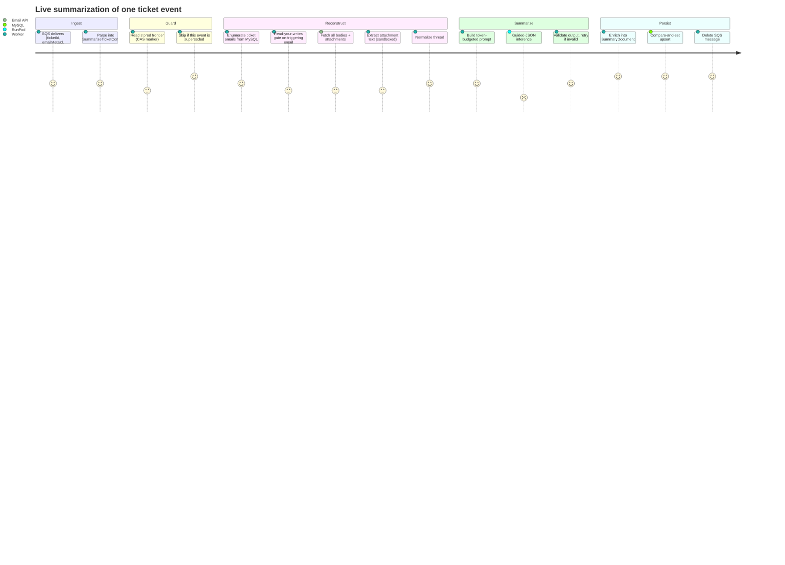

# 01 — Executive Summary & Overview

- [1. What this application does](#1-what-this-application-does)
- [2. Business purpose & domain](#2-business-purpose--domain)
- [3. Primary users](#3-primary-users)
- [4. Core workflows](#4-core-workflows)
- [5. What this system is _not_](#5-what-this-system-is-not)
- [6. Glossary](#6-glossary)

---

## 1. What this application does

`summarizer` is a **headless, event-driven backend worker**. For each new email that lands
on a Stepping Desk support ticket, it:

1. Receives a small SQS message — `{ticketId, emailMetaId, threadId}`.
2. Enumerates every email on that ticket from MySQL `Email_Metadata`.
3. Fetches each email's full body and attachments from an internal **Email API**.
4. Extracts text from attachments (PDF, DOCX, XLSX, CSV, TXT, and images via OCR) inside a
   resource-capped sandbox.
5. Normalizes the thread — strips quoted replies, signatures, and disclaimers; dedupes.
6. Builds a **versioned, token-budgeted prompt**.
7. Calls a self-hosted **Qwen2.5-7B-Instruct** model on RunPod/vLLM with **guided JSON
   decoding**.
8. Validates the model output against a Pydantic schema (with app-level retries).
9. Enriches it with system-computed provenance (attachment status, completeness, counts).
10. Writes the result to the `ticketAiSummary` MySQL table using a **(CAS)**
    strategy so out-of-order or duplicate events can never overwrite a newer summary.

## 2. Business purpose & domain

- **Domain:** enterprise IT/HR support ticketing. The host product is **Stepping Desk**,
  backed by MySQL database `TrackEaseV2DB`. The module vocabulary in
  [`domain/schema/v1.py`](../src/summarizer/domain/schema/v1.py#L46-L72) (Compensation, EC
  Payroll, LMS, Onboarding, PMGM, Time, Qualtrics, …) shows the domain is **SAP
  SuccessFactors-style HR/HCM support**.
- **Business goal (Phase 1):** give a support engineer a summary they can read **once** and
  immediately understand an entire multi-email ticket without opening the original thread.
  This is the first phase of a longer roadmap toward an AI-powered service desk (semantic
  search, RAG, auto-classification, auto-assignment). Those are **not** built here; the
  schema merely reserves room for them.
- **Volume & latency posture** (_from `CLAUDE.md`, corroborated by the low concurrency
  settings in code_): currently <100 tickets/day, 1–20 emails per ticket; ~1 minute of
  latency is acceptable. The system is explicitly **not** real-time — it is asynchronous and
  SQS-driven.

## 3. Primary users

This service has **no direct human users and no UI**. Its "users" are systems and roles:

| Consumer                          | Relationship                                                                                                                                                                                                                                             |
| --------------------------------- | -------------------------------------------------------------------------------------------------------------------------------------------------------------------------------------------------------------------------------------------------------- |
| **Stepping Desk backend**         | Produces SQS events when an email is created/replied. _Inferred from implementation_ — the producer side is not in this repo, but the consumed message shape is confirmed in [`sqs_consumer.py`](../src/summarizer/entrypoints/sqs_consumer.py#L79-L93). |
| **Support engineers (indirect)**  | The eventual readers of `ticketAiSummary.summary` / `summaryJson`, surfaced in the Stepping Desk UI. That UI is outside this repo.                                                                                                                       |
| **Operators / on-call engineers** | Run the CLI ([`entrypoints/cli.py`](../src/summarizer/entrypoints/cli.py)) for manual/backfill/reprocess runs and manage the SQS consumer process.                                                                                                       |
| **Data/ML (future)**              | The reserved `classification` field and versioned `summaryJson` are designed so a future embedding/RAG build can replay summaries from the table. Not implemented.                                                                                       |

## 4. Core workflows

There are two entrypoints into the **same** orchestrator (`SummarizeTicket.execute`):

### Workflow A — Live event processing (production path)



### Workflow B — Manual single-ticket run (CLI)

Used to exercise the pipeline against real infrastructure without SQS, and to perform
administrative **reprocess** runs (prompt/model upgrades). Same orchestrator, different
driver:

```bash
python -m summarizer.entrypoints.cli \
  --ticket-id 239908 --email-meta-id 134049 --thread-id "18fecd7164264ab8" [--reprocess]
```

Evidence: [`cli.py`](../src/summarizer/entrypoints/cli.py#L32-L64).

A third entrypoint, `entrypoints/backfill.py` for the ~40k historical tickets, is
**designed but not built** (see [`CLAUDE.md`](../CLAUDE.md) "no dedicated backfill queue").

## 5. What this system is _not_

To prevent hallucinated documentation, these are explicitly absent (verified by absence
across the whole tree):

## 6. Glossary

| Term                                   | Meaning                                                                                                                                                    |
| -------------------------------------- | ---------------------------------------------------------------------------------------------------------------------------------------------------------- |
| **Frontier / CAS marker**              | The `emailMetaId` of the newest email a ticket's summary reflects. Stored in `ticketAiSummary.emailMetaId` and used to reject stale/out-of-order writes.   |
| **CAS (compare-and-set)**              | The write strategy: only overwrite a summary if the incoming `emailMetaId` is newer than the stored one.                                                   |
| **RYW gate (read-your-writes)**        | A guard that refuses to summarize until the _triggering_ email is actually fetchable from the Email API, so a thread is never summarized while incomplete. |
| **`emailMetaId`**                      | Primary key of a row in `Email_Metadata` (one email). Monotonically increasing; doubles as ordering + frontier marker.                                     |
| **`threadId`**                         | Short hex string (e.g. `18fecd7164264ab8`) identifying an email thread. **Not** an RFC-822 Message-ID. Used as an Email API lookup key.                    |
| **Port**                               | A `Protocol` interface in [`domain/ports.py`](../src/summarizer/domain/ports.py) that the application depends on.                                          |
| **Adapter**                            | A concrete implementation of a port, living in `adapters/`.                                                                                                |
| **Guided / constrained JSON decoding** | vLLM feature that forces the model's output to conform to a JSON schema during generation (via the `outlines` backend).                                    |
| **`SummaryDocument`**                  | The full persisted envelope: validated LLM output + system-computed provenance. Stored in `summaryJson`.                                                   |
| **`LlmSummaryOutput`**                 | The subset the LLM is responsible for producing; also the source of the guided-decoding schema.                                                            |
| **`WriteMode`**                        | `APPEND_ONLY` (live/DLQ) vs `REPROCESS` (administrative force-overwrite).                                                                                  |
| **`WriteOutcome`**                     | `WRITTEN` vs `SKIPPED_SUPERSEDED`.                                                                                                                         |
| **Status lifecycle**                   | `OK` / `PARTIAL` (persisted) and `TRANSIENT_FAIL` / `TERMINAL_FAIL` (never persisted — mapped to queue behaviour).                                         |
| **DLQ**                                | Dead-letter queue. The live queue has `maxReceiveCount=5`; exhausted messages route there via SQS's own redrive policy.                                    |
| **`isNote`**                           | A flag on `Email_Metadata` marking an internal note vs a real email; carried through and labelled `[Internal Note]` in the prompt.                         |
| **worker-vllm**                        | The RunPod Serverless container image (v2.14.0) exposing an OpenAI-compatible vLLM route.                                                                  |
| **Stepping Desk / TrackEaseV2DB**      | The host ticketing product and its MySQL database.                                                                                                         |
