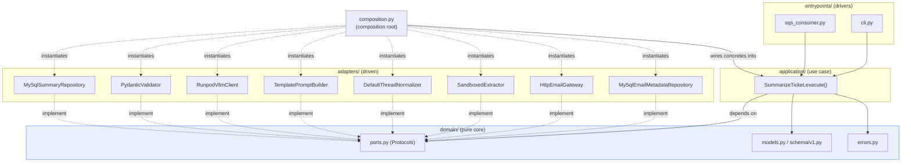
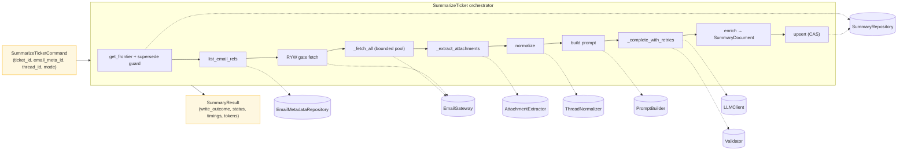
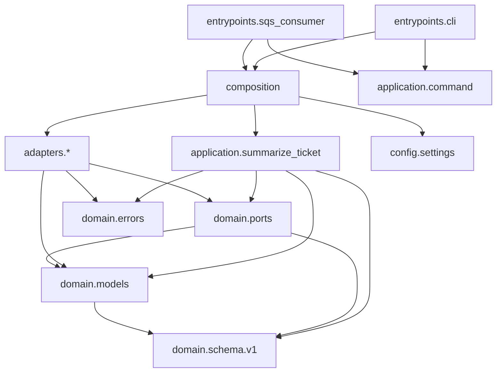

# 02 — High-Level & Application Architecture

- [1. Architectural style](#1-architectural-style)
- [2. Why it was designed this way](#2-why-it-was-designed-this-way)
- [3. The layers & the dependency rule](#3-the-layers--the-dependency-rule)
- [4. Module boundaries & the seven ports](#4-module-boundaries--the-seven-ports)
- [5. Component diagram](#5-component-diagram)
- [6. Dependency graph](#6-dependency-graph)
- [7. Folder structure — and why each folder exists](#7-folder-structure--and-why-each-folder-exists)
- [8. Design patterns (with evidence)](#8-design-patterns-with-evidence)

---

## 1. Architectural style

**Hexagonal Architecture (Ports & Adapters), layered as Clean Architecture.** This is
explicit, not inferred: the folder layout, the `domain/ports.py` `Protocol` interfaces, and
the single `composition.py` wiring root are the textbook signature of the pattern.



## 2. Why it was designed this way

The design choices are documented in code and `CLAUDE.md`; the *architectural payoff* is:

- **The LLM, MySQL, the Email API, RunPod, and SQS are all swappable I/O details.** The
  orchestrator ([`summarize_ticket.py`](../src/summarizer/application/summarize_ticket.py))
  imports **zero** concrete adapters — only ports and domain models. You could replace RunPod
  with any LLM, or MySQL with anything, without touching the business logic.
- **Testability without infrastructure.** Because every dependency is a `Protocol`, the 213
  unit tests substitute hand-written fakes rather than mocking libraries. `pytest` runs green
  with **no** database, no network, no Docker (see [`pyproject.toml`](../pyproject.toml#L54-L59):
  `addopts = "-m 'not integration'"`).
- **The correctness core is isolated and pure.** The CAS decision (`decide_write` in
  [`mysql_summary_repository.py`](../src/summarizer/adapters/persistence/mysql_summary_repository.py#L81-L103))
  is a pure function, unit-tested exhaustively without a DB.
- **Future extension points are seams, not rewrites.** Embeddings/RAG attach as a *decorator*
  around the `SummaryRepository` port — declared as a Phase-2 seam, not scattered calls.

## 3. The layers & the dependency rule

The dependency rule is **inward-only**: `entrypoints → application → domain`, and
`adapters → domain`. Nothing in `domain` imports from an outer layer.

| Layer | Package | May import | Contains |
|-------|---------|-----------|----------|
| **Domain** | `domain/` | stdlib, pydantic only | Ports (Protocols), data carriers, schema, error hierarchy. No I/O. |
| **Application** | `application/` | `domain` | The `SummarizeTicket` orchestrator, its command & result DTOs. |
| **Adapters** | `adapters/` | `domain` | Concrete port implementations (MySQL, HTTP, extraction, LLM, …). |
| **Config / Observability** | `config/` | 3rd-party settings/logging libs | Settings, structured logging. |
| **Entrypoints** | `entrypoints/` | everything (thin) | CLI & SQS drivers. |
| **Composition** | `composition.py` | everything | The **only** place concretes are named and wired. |

Verified: the domain files import only `dataclasses`, `enum`, `typing`, and `pydantic`.
`ports.py` imports from `domain.models` and `domain.schema` only — no adapter, no framework.

## 4. Module boundaries & the seven ports

Every external interaction crosses one of seven port boundaries, all declared in
[`domain/ports.py`](../src/summarizer/domain/ports.py):

```mermaid
classDiagram
    class EmailMetadataRepository {
        <<Protocol>>
        +list_email_refs(ticket_id) list~EmailRef~
    }
    class EmailGateway {
        <<Protocol>>
        +fetch_email(ticket_id, email_meta_id, message_id, thread_id) RawEmail
    }
    class AttachmentExtractor {
        <<Protocol>>
        +extract(attachment) ExtractedAttachment
    }
    class ThreadNormalizer {
        <<Protocol>>
        +normalize(emails) NormalizedConversation
    }
    class PromptBuilder {
        <<Protocol>>
        +prompt_version str
        +build(conversation, attachments, context_budget) Prompt
    }
    class LLMClient {
        <<Protocol>>
        +model_name str
        +model_version str
        +complete(prompt) LlmRawResponse
    }
    class Validator {
        <<Protocol>>
        +validate(raw) LlmSummaryOutput
    }
    class SummaryRepository {
        <<Protocol>>
        +get_frontier(ticket_id) int?
        +upsert(ticket_id, write, marker, mode) WriteOutcome
    }

    EmailMetadataRepository <|.. MySqlEmailMetadataRepository
    EmailGateway <|.. HttpEmailGateway
    AttachmentExtractor <|.. SandboxedExtractor
    ThreadNormalizer <|.. DefaultThreadNormalizer
    PromptBuilder <|.. TemplatePromptBuilder
    LLMClient <|.. RunpodVllmClient
    Validator <|.. PydanticValidator
    SummaryRepository <|.. MySqlSummaryRepository
```



| Port | Adapter | Responsibility boundary |
|------|---------|------------------------|
| `EmailMetadataRepository` | `MySqlEmailMetadataRepository` | Enumerate a ticket's non-draft, non-deleted emails ordered by `emailMetaId`. |
| `EmailGateway` | `HttpEmailGateway` | Fetch one email's full body + attachments from the Email API. |
| `AttachmentExtractor` | `SandboxedExtractor` | Extract text from one attachment, capped & never-raising. |
| `ThreadNormalizer` | `DefaultThreadNormalizer` | Clean a raw thread into a normalized conversation. |
| `PromptBuilder` | `TemplatePromptBuilder` | Assemble a versioned, budgeted system+user prompt. |
| `LLMClient` | `RunpodVllmClient` | One guided-JSON inference call. |
| `Validator` | `PydanticValidator` | Parse + schema-validate raw output. |
| `SummaryRepository` | `MySqlSummaryRepository` | CAS read/write of the summary row. |

## 5. Component diagram



## 6. Dependency graph

Module-level import direction (arrows point to the imported module). Note that **all**
arrows point inward toward `domain`, and only `composition` reaches across everything.



**Observation (evidence):** `domain/models.py` imports `ExtractionStatus` from
`domain/schema/v1.py` mid-file with a documented `# noqa: E402`
([models.py:81-84](../src/summarizer/domain/models.py#L81-L84)). This is a deliberate
domain-to-domain reuse to avoid duplicating the enum — not a layer violation.

## 7. Folder structure — and why each folder exists

```
src/summarizer/
├── domain/              WHY: the pure core. Business types & contracts with zero I/O,
│   ├── models.py            so they can be imported anywhere without pulling in a driver.
│   ├── schema/
│   │   └── v1.py            WHY: versioned Pydantic schema. Doubles as the LLM's
│   │                            guided-decoding contract AND the validation contract —
│   │                            one source of truth (model_json_schema()).
│   ├── ports.py             WHY: the seams. Protocols the app depends on; adapters implement.
│   └── errors.py            WHY: a two-branch error taxonomy that entrypoints map
│                                mechanically to queue behaviour.
├── application/         WHY: use-case orchestration. Depends only on domain — the "what
│   ├── summarize_ticket.py   happens, in what order" with no knowledge of how I/O is done.
│   ├── command.py            WHY: typed input DTO (a message's worth of work).
│   └── result.py             WHY: typed output DTO (what happened, for logging/metrics).
├── adapters/            WHY: all the messy I/O, one folder per concern, each behind a port.
│   ├── email/               MySQL enumeration + HTTP fetch (two adapters, one concern).
│   ├── extraction/          Sandboxed per-format text extraction (extractor + handlers).
│   ├── normalize/           Thread cleaning (quote/sig stripping, HTML fallback).
│   ├── prompt/              Versioned prompt assembly + templates/v1, templates/v2.
│   ├── llm/                 RunPod/vLLM client.
│   ├── validation/          Pydantic validation of raw output.
│   └── persistence/         CAS summary repository.
├── config/              WHY: startup wiring of environment → typed settings, + logging.
├── entrypoints/         WHY: thin drivers (CLI, SQS). Deliberately dumb — all logic is
│                            in the orchestrator so both drivers share it.
├── composition.py       WHY: the ONE place concretes are named. Swap implementations here.
└── py.typed             WHY: PEP 561 marker — ships type information to consumers.
```

`tests/` mirrors `src/` (`tests/unit/<same path>`), plus `tests/integration/` (Docker/MySQL,
excluded by default). _Inferred convention from the parallel tree._

## 8. Design patterns (with evidence)

| Pattern | Where | Evidence |
|---------|-------|----------|
| **Hexagonal / Ports & Adapters** | whole codebase | `domain/ports.py` Protocols + `adapters/` implementations. |
| **Clean Architecture (dependency rule)** | layer layout | `domain` imports nothing outward; verified. |
| **Dependency Injection (constructor)** | `SummarizeTicket.__init__`, all adapters | [summarize_ticket.py:64-89](../src/summarizer/application/summarize_ticket.py#L64-L89). No globals, no service locator. |
| **Composition Root** | `composition.py` | Single `build_use_case(settings)` factory. |
| **Repository** | `MySqlSummaryRepository`, `MySqlEmailMetadataRepository` | Data access behind an interface. |
| **Gateway** | `HttpEmailGateway` | External-service access behind an interface. |
| **Adapter** | every `adapters/*` class | Wraps a 3rd-party lib to satisfy a port. |
| **Strategy** | `WriteMode` (APPEND_ONLY vs REPROCESS) | `decide_write` switches CAS behaviour by enum. |
| **Template Method / Versioned Strategy** | `TemplatePromptBuilder` + `templates/<version>/` | Prompt behaviour selected by `prompt_version`. |
| **Factory** | `_build_connection_factory` | [composition.py:26-37](../src/summarizer/composition.py#L26-L37) returns a `Callable[[], Connection]`. |
| **DTO / Value Object** | frozen `@dataclass(slots=True)` throughout `domain/models.py` | Immutable data carriers. |
| **Pure-core / Functional-core** | `decide_write`, `_build_completeness` | Pure decision functions extracted for testability. |
| **Decorator (seam, deferred)** | `SummaryRepository` | Documented Phase-2 outbox decorator seam (not built). |
| **Guard clause / early return** | orchestrator, extractor, gateway | Consistent `if bad: return/raise` style. |
