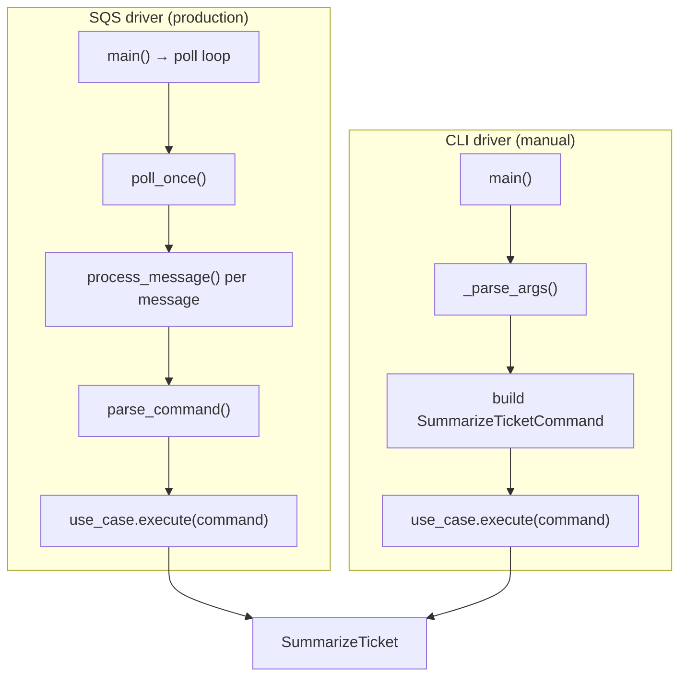
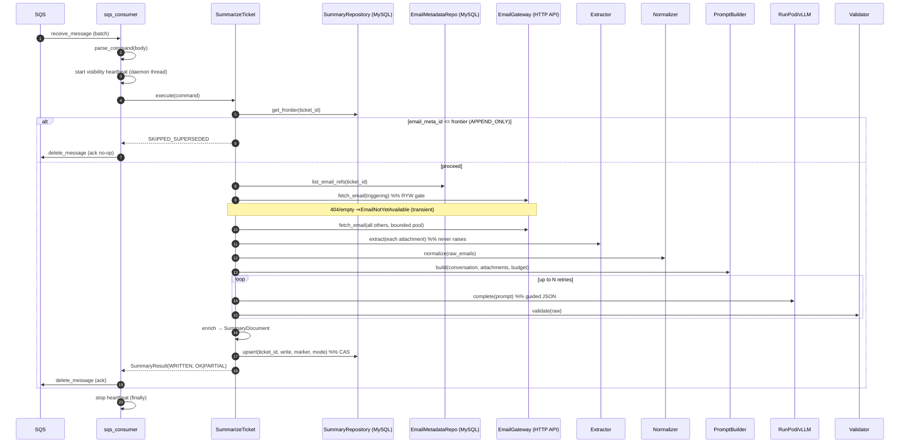
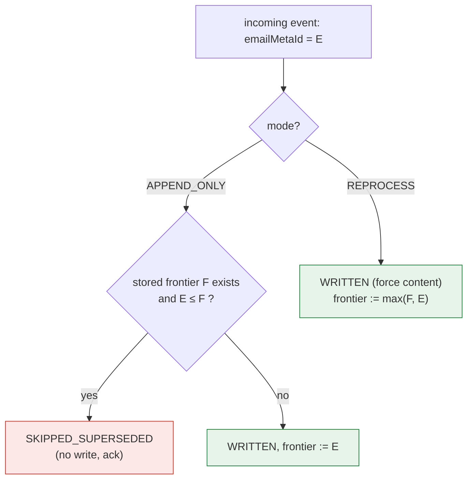
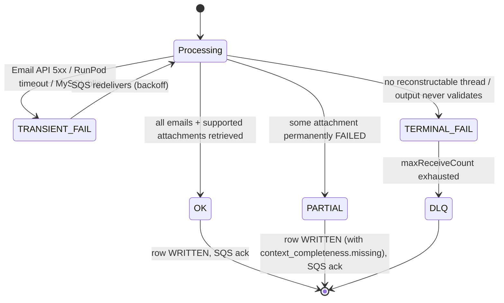
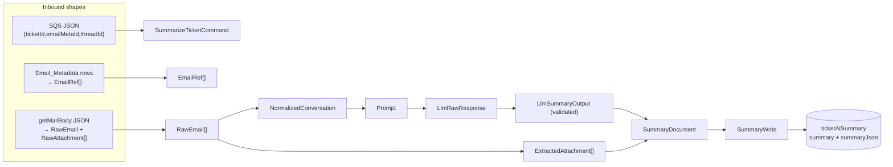

# 03 — Pipeline, Event Routing, Data Flow & State

> **Scope note.** The requested sections *Routing*, *State Management*, *Component
> Architecture*, and *Rendering lifecycle* assume a web frontend. This is a backend worker,
> so this document maps each of those concepts to its **real backend analog** and states
> plainly where the concept does not exist.

- [1. "Routing" = event dispatch](#1-routing--event-dispatch)
- [2. The end-to-end data flow](#2-the-end-to-end-data-flow)
- [3. Request/event lifecycle (sequence)](#3-requestevent-lifecycle-sequence)
- [4. "State management" = the CAS frontier](#4-state-management--the-cas-frontier)
- [5. Status lifecycle (state diagram)](#5-status-lifecycle-state-diagram)
- [6. Data lifecycle: how a message becomes a row](#6-data-lifecycle-how-a-message-becomes-a-row)
- [7. Concurrency model](#7-concurrency-model)
- ["Rendering lifecycle"](#rendering-lifecycle)

---

## 1. "Routing" = event dispatch

There is **no HTTP router and no route table.** The analog is: how an inbound unit of work
is dispatched to the orchestrator. There are two drivers, both terminating at
`SummarizeTicket.execute(command)`.



**Dispatch rules (the closest thing to "middleware"):** the SQS driver wraps `execute()` in
a mechanical mapping from the error taxonomy to queue behaviour — this is the real routing
logic of the system:

| Outcome of `execute()` | SQS driver action | Evidence |
|------------------------|-------------------|----------|
| Success (`WRITTEN` or `SKIPPED_SUPERSEDED`) | `delete_message` (ack) | [sqs_consumer.py:197](../src/summarizer/entrypoints/sqs_consumer.py#L197) |
| `TransientError` | leave unacked → SQS redelivers | [sqs_consumer.py:155-165](../src/summarizer/entrypoints/sqs_consumer.py#L155-L165) |
| `TerminalError` | leave unacked → ages to DLQ via `maxReceiveCount` | [sqs_consumer.py:166-176](../src/summarizer/entrypoints/sqs_consumer.py#L166-L176) |
| `MalformedMessage` | log & return (unacked → DLQ) | [sqs_consumer.py:142-148](../src/summarizer/entrypoints/sqs_consumer.py#L142-L148) |
| Unexpected `Exception` | log with traceback, leave unacked; **never crash the poller** | [sqs_consumer.py:184-193](../src/summarizer/entrypoints/sqs_consumer.py#L184-L193) |

The CLI does the same mapping but collapses all failures to exit code `1`
([cli.py:66-76](../src/summarizer/entrypoints/cli.py#L66-L76)).

## 2. The end-to-end data flow

The prompt's canonical "User action → UI → State → API → DB → Response → Rendering" chain
maps here to:

```
SQS event
  ↓
parse_command → SummarizeTicketCommand           (Ingest)
  ↓
get_frontier → supersede guard                    (State check)
  ↓
list_email_refs (MySQL)                           (Enumerate)
  ↓
RYW gate fetch + _fetch_all (Email API)           (Reconstruct)
  ↓
_extract_attachments (sandbox)                    (Transform)
  ↓
normalize (clean thread)                          (Transform)
  ↓
build prompt (token budget)                       (Assemble)
  ↓
complete + validate (RunPod/vLLM, retry)          (Infer)
  ↓
enrich → SummaryDocument                          (Enrich)
  ↓
upsert CAS (MySQL ticketAiSummary)                (Persist)
  ↓
SummaryResult → delete SQS message                (Ack)
```

## 3. Request/event lifecycle (sequence)



## 4. "State management" = the CAS frontier

There is **no in-memory application state, no cache, no store, no session.** The pipeline is
stateless per message. The *only* persistent state is one row per ticket in
`ticketAiSummary`, and its `emailMetaId` column is the single piece of state that governs
correctness: the **frontier**.



This is checked **twice** for defence in depth:
1. **Early guard** in the orchestrator before doing any work
   ([summarize_ticket.py:94-104](../src/summarizer/application/summarize_ticket.py#L94-L104)) — an optimization to skip fetching/inference for a clearly-superseded event.
2. **Authoritative CAS** inside the DB transaction under `SELECT ... FOR UPDATE`
   ([mysql_summary_repository.py:148-204](../src/summarizer/adapters/persistence/mysql_summary_repository.py#L148-L204)) — the real guarantee, safe against concurrency and races.

Why this matters: SQS is **standard (not FIFO)**, so events can arrive out of order or be
delivered more than once. The frontier makes every write idempotent and order-independent —
which is *also* what makes the (unbuilt) 40k-ticket backfill resumable for free.

## 5. Status lifecycle (state diagram)



**Key invariant (enforced by types):** only `OK` and `PARTIAL` are ever persisted. This is
made unrepresentable-if-wrong by the `PersistedSummaryStatus` enum
([ports.py:37-47](../src/summarizer/domain/ports.py#L37-L47)), which has *only* those two
members — the repository literally cannot be handed a `TRANSIENT_FAIL`.

- `OK` vs `PARTIAL` is derived purely from attachment extraction status
  ([summarize_ticket.py:159-172](../src/summarizer/application/summarize_ticket.py#L159-L172),
  `_build_completeness`). A permanently-failed *email* (not attachment) is treated as a
  transient/terminal condition and is **not** downgraded to `PARTIAL` — a deliberate scoping
  choice documented in `CLAUDE.md`.

## 6. Data lifecycle: how a message becomes a row



Each arrow is a pure transformation between the frozen dataclasses in
[`domain/models.py`](../src/summarizer/domain/models.py) and the Pydantic models in
[`domain/schema/v1.py`](../src/summarizer/domain/schema/v1.py). The **provenance split** is
deliberate: `LlmSummaryOutput` is everything the model produced; `SummaryDocument` wraps it
with system-computed facts (`attachments`, `context_completeness`, `source`) the model is
never allowed to assert. This keeps grounding trustworthy — a 7B model cannot hallucinate
an extraction status it never saw.

## 7. Concurrency model

Three distinct, bounded concurrency mechanisms — all `ThreadPoolExecutor`-based (the
workload is I/O-bound, so threads suffice):

| Where | Mechanism | Default | Purpose |
|-------|-----------|---------|---------|
| SQS consumer | `ThreadPoolExecutor(max_workers=concurrency)` over a message batch | **3** | Process several messages in parallel. Kept low — RunPod is one shared GPU. |
| Email fetch | `ThreadPoolExecutor(max_workers=email_fetch_concurrency)` in `_fetch_all` | **5** | Fetch a ticket's emails concurrently; reuses the RYW fetch to avoid double-fetching. |
| Attachment extraction | `ThreadPoolExecutor(max_workers=1)` per attachment, with `future.result(timeout=…)` | 1 | A **wall-clock timeout wrapper**, not parallelism — lets a hung extraction be abandoned. |

Plus the **visibility heartbeat**: a daemon thread per in-flight SQS message that re-extends
the message's visibility timeout every `visibility_timeout - margin` seconds, so a slow
RunPod cold start can't cause mid-flight redelivery
([sqs_consumer.py:96-121](../src/summarizer/entrypoints/sqs_consumer.py#L96-L121)).

## "Rendering lifecycle"

**Not applicable.** There is no rendering — no UI, no templates rendered to a client, no
DOM. The nearest analog is *prompt assembly* (turning a normalized conversation into text
for the LLM), fully covered in [04 — Backend Internals](04-backend.md#5-prompt-assembly).
