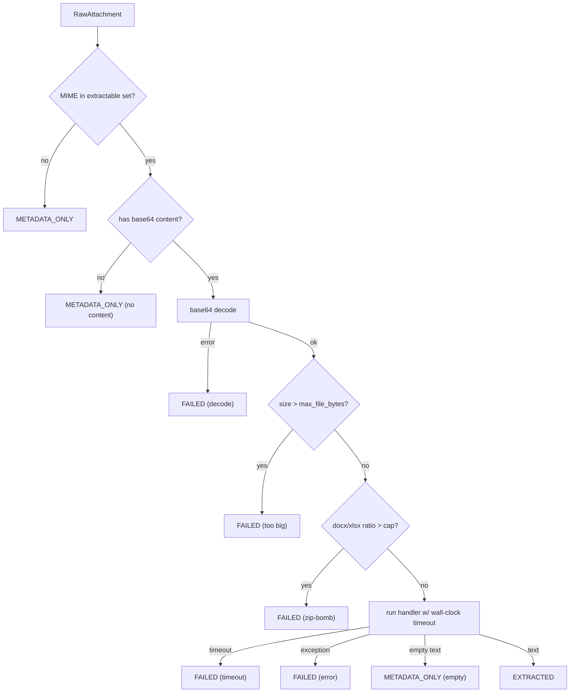
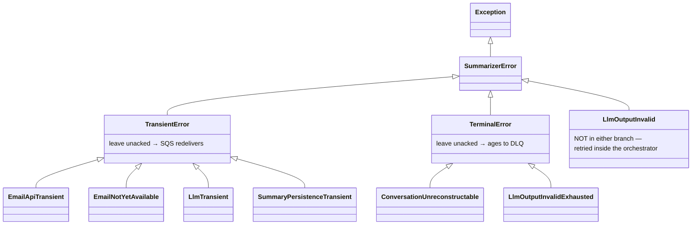

# 04 — Backend Internals, Services & Error Handling

- [1. The orchestrator](#1-the-orchestrator)
- [2. Email retrieval (two adapters)](#2-email-retrieval-two-adapters)
- [3. Attachment extraction (sandbox)](#3-attachment-extraction-sandbox)
- [4. Thread normalization](#4-thread-normalization)
- [5. Prompt assembly](#5-prompt-assembly)
- [6. LLM client](#6-llm-client)
- [7. Validation](#7-validation)
- [8. Persistence & the CAS write](#8-persistence--the-cas-write)
- [9. Error handling](#9-error-handling)
- [10. Logging & observability](#10-logging--observability)
- [11. Shared utilities & helpers](#11-shared-utilities--helpers)

---

## 1. The orchestrator

[`application/summarize_ticket.py`](../src/summarizer/application/summarize_ticket.py) is the
single use-case. It takes eight injected ports plus three tuning knobs and runs the pipeline
in a fixed order. Notable design decisions in the code:

- **The RYW-gate fetch is reused, not repeated.** `_fetch_all` seeds a cache with the
  triggering email so it isn't fetched twice
  ([L202-219](../src/summarizer/application/summarize_ticket.py#L202-L219)).
- **`is_note` is stitched back on after fetch.** The Email API doesn't return the note flag;
  it comes from `Email_Metadata`. The orchestrator uses
  `dataclasses.replace(raw, is_note=ref.is_note)` to correlate it — clean because `RawEmail`
  is frozen ([L216](../src/summarizer/application/summarize_ticket.py#L216)).
- **`thread_id` cross-check.** The command's `thread_id` overrides what `Email_Metadata`
  has, but a mismatch is logged as a `WARNING` rather than silently chosen
  ([L116-127](../src/summarizer/application/summarize_ticket.py#L116-L127)).
- **App-level retry loop** for invalid LLM output, accumulating token counts across attempts
  and raising `LlmOutputInvalidExhausted` only after exhaustion
  ([`_complete_with_retries`, L228-250](../src/summarizer/application/summarize_ticket.py#L228-L250)).

## 2. Email retrieval (two adapters)

Two adapters, one concern, both using a **connection-factory** pattern (one PyMySQL
connection per call, closed in `finally`):

### `MySqlEmailMetadataRepository`
Runs one parameterized `SELECT` against `Email_Metadata`, filtering out drafts and deleted
rows, **including notes**, ordered by `emailMetaId ASC`
([mysql_email_metadata.py:23-30](../src/summarizer/adapters/email/mysql_email_metadata.py#L23-L30)).
Transient MySQL error codes `{1205, 1213, 2006, 2013}` are wrapped as
`SummaryPersistenceTransient`; anything else propagates raw.

### `HttpEmailGateway`
Calls the internal Email API's `getMailBody` endpoint. Two subtle, hard-won pieces of logic
worth knowing:

1. **Data-URI stripping.** Attachments arrive as `data:<mime>;base64,<data>`, and
   `base64.b64decode` does **not** error on the prefix (its letters are valid base64) — it
   silently produces corrupt bytes. `_strip_data_uri_prefix`
   ([http_email_gateway.py:46-55](../src/summarizer/adapters/email/http_email_gateway.py#L46-L55))
   removes it explicitly.
2. **Defensive RYW signalling.** "Not yet available" may be HTTP 404 *or* a body-level
   `status` field on a 200 — the second is unconfirmed against staging, so `_unwrap_envelope`
   handles both ([L117-141](../src/summarizer/adapters/email/http_email_gateway.py#L117-L141)).

`companyId` is a hardcoded constant `"steppingcloud"`
([L43](../src/summarizer/adapters/email/http_email_gateway.py#L43)). `message_id` is on the
signature but **not sent on the wire** (it's the `RawEmail` fallback id).

## 3. Attachment extraction (sandbox)

[`SandboxedExtractor`](../src/summarizer/adapters/extraction/extractor.py) dispatches by MIME
type to a per-format handler and **never raises** — the port contract. Every failure mode
degrades to a status, not an exception:

**Hardening controls** (see [07 — Security](07-security.md)): size cap, wall-clock timeout,
decompression-ratio cap (zip-bomb defence for archive formats), XLSX row/cell caps, and —
for free — XXE/billion-laughs protection because `python-docx` and `openpyxl` disable
external entity resolution via `lxml`. Images use Tesseract OCR; Pillow's
`MAX_IMAGE_PIXELS` guard covers decompression bombs.

Handlers live in [`handlers.py`](../src/summarizer/adapters/extraction/handlers.py): PyMuPDF
(PDF), python-docx (DOCX), openpyxl (XLSX), stdlib `csv`, plain decode (TXT), pytesseract
(images). The image handler also probes common Windows install paths for `tesseract.exe`
([handlers.py:101-111](../src/summarizer/adapters/extraction/handlers.py#L101-L111)) — a dev
convenience; production Linux images must have `tesseract-ocr` on `PATH`.

## 4. Thread normalization

[`DefaultThreadNormalizer`](../src/summarizer/adapters/normalize/normalizer.py) turns raw
emails into a clean conversation. Body-selection precedence
([`_clean_body`, L161-200](../src/summarizer/adapters/normalize/normalizer.py#L161-L200)):

1. `latest_text_body` (new reply only, pre-stripped by the API) → strip signatures.
2. else `text_body` (full accumulated) → `email_reply_parser` → strip signatures.
3. else **HTML fallback**: flatten `html_body` via a stdlib `HTMLParser`
   (`_HtmlTextExtractor`) → same quote/sig stripping.

The HTML fallback exists because **agent replies composed in Stepping Desk's own editor
carry only `mailBody` (HTML) with no plain-text part** — without it, half the conversation
(the support side) silently vanished. This was a real, fixed bug
([normalizer.py:72-94](../src/summarizer/adapters/normalize/normalizer.py#L72-L94)).

Dedup is exact-body (`body.strip().lower()` set). A `_pii_mask` hook exists as a documented
**no-op pass-through** — the single insertion point for future PII masking
([L226-234](../src/summarizer/adapters/normalize/normalizer.py#L226-L234)).

## 5. Prompt assembly

[`TemplatePromptBuilder`](../src/summarizer/adapters/prompt/prompt_builder.py) builds a
`system_message` + `user_message` pair (not one pre-templated string — the OpenAI-compatible
route applies Qwen's chat template server-side).

- **Schema is the contract.** The system template contains a `{{JSON_SCHEMA}}` placeholder,
  filled from `LlmSummaryOutput.model_json_schema()`. The same schema is passed to the LLM as
  `response_format`/`json_schema`. One source of truth for structure.
- **Versioned templates.** `_load_system_template(prompt_version)` loads
  `templates/<version>/system.txt`, falling back to `v1` for any version without its own
  folder — so `prompt_version` doubles as a free-form provenance label
  ([L39-51](../src/summarizer/adapters/prompt/prompt_builder.py#L39-L51)).
- **Token budgeting.** Uses `tiktoken` `cl100k_base` as an *estimate*. Reserves 2048 tokens
  for output. If over budget, truncates in order: **attachment text first, then oldest
  emails one at a time** ([`_truncate`, L132-167](../src/summarizer/adapters/prompt/prompt_builder.py#L132-L167)).

> ⚠️ **Known defect** (see [10 — Technical Debt](10-technical-debt.md#t1)): a debug block at
> [L101-111](../src/summarizer/adapters/prompt/prompt_builder.py#L101-L111) logs the **entire
> assembled prompt** — including full email bodies and attachment text — at `INFO`. This
> violates the stated logging policy ("never log email bodies/PII") and should be removed.

## 6. LLM client

[`RunpodVllmClient`](../src/summarizer/adapters/llm/runpod_vllm_client.py) makes **one
synchronous POST** to
`https://api.runpod.ai/v2/{endpoint_id}/openai/v1/chat/completions` (the OpenAI-compatible
route, not RunPod's native `/run`+poll). Body: `model`, `messages`, `max_tokens`,
`temperature`, `top_p`, `repetition_penalty`, and `response_format`.

> ⚠️ Structured output **must** be sent as OpenAI `response_format`/`json_schema`, never as a
> flat top-level `guided_json`. The endpoint silently ignores unknown top-level fields, so
> `guided_json` ran fully unconstrained with no error of any kind — the pipeline's real
> behaviour from inception until 2026-07-22. Proof and reproduction probe are in the client's
> module docstring.

Error mapping ([L100-102](../src/summarizer/adapters/llm/runpod_vllm_client.py#L100-L102)):
- **5xx / connection / timeout → `LlmTransient`** (retry via SQS; there is no fallback LLM).
- **4xx → propagates unwrapped** (config/auth/model-name bug — fail loudly, don't retry
  forever).

Tokens come from `usage.prompt_tokens` / `usage.completion_tokens` when present (optional).

## 7. Validation

[`PydanticValidator`](../src/summarizer/adapters/validation/pydantic_validator.py) is the
last line of defence even though guided decoding *should* already conform:
1. Strip markdown code fences defensively (`_CODE_FENCE` regex).
2. `json.loads`.
3. `LlmSummaryOutput.model_validate`.

Any failure → `LlmOutputInvalid`, which drives an app-level retry (not a queue retry). Note
the schema itself defends against a known vLLM quirk: a `field_validator(mode="before")`
coerces `null` → `[]` for the four list fields, because the `outlines` backend occasionally
emits `null` for an array-typed field
([schema/v1.py:151-163](../src/summarizer/domain/schema/v1.py#L151-L163)).

## 8. Persistence & the CAS write

Covered in depth in [06 — Database](06-database.md). Summary of the mechanism in
[`MySqlSummaryRepository`](../src/summarizer/adapters/persistence/mysql_summary_repository.py):

- Explicit transaction + `SELECT emailMetaId ... FOR UPDATE` to serialize same-ticket writers.
- Pure `decide_write(stored, incoming, mode)` returns `WRITTEN`/`SKIPPED_SUPERSEDED` + the
  new marker.
- Brand-new tickets can race on `INSERT`; the loser catches `IntegrityError`, rolls back, and
  retries exactly once (proven sufficient — the second attempt finds a row to lock).
- Transient MySQL codes wrapped as `SummaryPersistenceTransient`; unknown errors propagate.

## 9. Error handling

A **two-branch taxonomy** ([`domain/errors.py`](../src/summarizer/domain/errors.py)) that
the entrypoints map mechanically to queue behaviour:

Design principles baked into this:
- **`LlmOutputInvalid` is deliberately outside the transient/terminal hierarchy** — it's a
  per-attempt retry signal, handled *inside* the orchestrator, never by the entrypoint.
  After exhaustion it is re-raised as `LlmOutputInvalidExhausted` (terminal).
- **Unknown exceptions are never swallowed.** A programming error propagates unwrapped so it
  fails loudly, rather than being misclassified as a normal business outcome. The SQS driver
  catches it only to avoid crashing the poller, and logs a full traceback.
- **Per-attachment failures are never pipeline failures** — they degrade to `FAILED` in
  place and (if any) mark the summary `PARTIAL`.

## 10. Logging & observability

[`config/logging_config.py`](../src/summarizer/config/logging_config.py) configures stdlib
`logging` with a custom `_JsonFormatter` emitting one JSON object per line.

- **Allow-list, not blanket.** Only an explicit set of `extra=` keys is copied into the log
  payload (`ticket_id`, `message_id`, `thread_id`, `email_meta_id`, `write_outcome`,
  `status`, `processing_time_ms`, `retry_count`, `token_input`, `token_output`, `queue_url`,
  `count`, `receive_count`, `signal`). This is a **deliberate anti-leak measure** — a
  careless future `extra=` cannot dump an email body into logs
  ([L34-52](../src/summarizer/config/logging_config.py#L34-L52)).
- Idempotent setup (guards against duplicate handlers); quiets `urllib3` and `pymysql`.
- **No metrics/tracing backend is wired** — no Prometheus, no OpenTelemetry, no APM. The
  `observability/` folder mentioned in `CLAUDE.md`'s sketch does **not** exist in the tree.
  Operational data travels only as structured log fields. _Inferred from implementation._

> The allow-list discipline is undermined by the prompt-logging defect (§5 above) — that log
> line bypasses the whole point of this allow-list. See [10 — Technical Debt](10-technical-debt.md#t1).

## 11. Shared utilities & helpers

This codebase is deliberately light on shared "utils" — logic lives with the adapter that
owns it. The reusable pieces are:

| Helper | Location | Reused by |
|--------|----------|-----------|
| `connection_factory` (`Callable[[], Connection]`) | `composition.py` | both MySQL adapters |
| `_TRANSIENT_MYSQL_ERROR_CODES` `{1205,1213,2006,2013}` | duplicated in both MySQL adapters | — (see debt: minor duplication) |
| `_strip_data_uri_prefix` | `http_email_gateway.py` | attachment parsing |
| `_html_to_text` / `_HtmlTextExtractor` | `normalizer.py` | HTML-only body fallback |
| `decide_write` (pure CAS logic) | `mysql_summary_repository.py` | the upsert; unit tests |
| `_JsonFormatter` | `logging_config.py` | every entrypoint |
