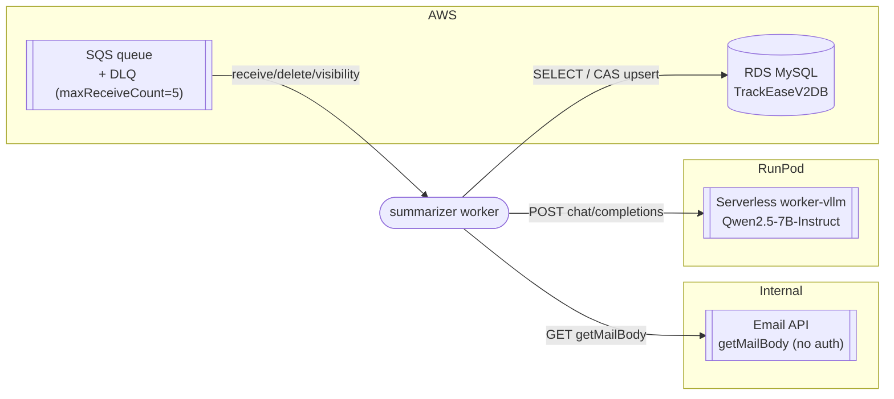

# 05 — Interfaces, Contracts & External Integrations

> **Scope note.** This worker **exposes no HTTP API** — there are no routes, controllers, or
> handlers serving requests. Verified across the whole tree (no web framework in
> [`pyproject.toml`](../pyproject.toml)). This document therefore covers the three real
> "APIs" that matter: (1) the SQS **message contract** it consumes, (2) the CLI **command
> contract**, and (3) the external service contracts it **calls** (Email API, RunPod).

- [1. Inbound contract A — SQS message](#1-inbound-contract-a--sqs-message)
- [2. Inbound contract B — CLI](#2-inbound-contract-b--cli)
- [3. Outbound integration — Internal Email API](#3-outbound-integration--internal-email-api)
- [4. Outbound integration — RunPod / vLLM](#4-outbound-integration--runpod--vllm)
- [5. Outbound integration — MySQL](#5-outbound-integration--mysql)
- [6. Outbound integration — AWS SQS](#6-outbound-integration--aws-sqs)
- [7. Integration map](#7-integration-map)

---

## 1. Inbound contract A — SQS message

The production trigger. One message per new email on a ticket.

| Field | Purpose |
|-------|---------|
| **Method** | SQS `ReceiveMessage` long-poll (`WaitTimeSeconds=20`, `MaxNumberOfMessages=10`) |
| **Queue** | `steppingcloud-stage-ticket-ai-summary-queue` (ap-south-1) |
| **Body (JSON)** | `{"ticketId": <int>, "emailMetaId": <int>, "threadId": <string>}` |
| **Auth** | AWS credentials via boto3 default chain (env vars) |
| **Success** | message deleted (ack) |
| **Failure** | left unacked; SQS redelivers up to `maxReceiveCount=5`, then DLQ |

**Example payload**
```json
{ "ticketId": 239908, "emailMetaId": 134049, "threadId": "18fecd7164264ab8" }
```

**Parsing / errors** ([`parse_command`, sqs_consumer.py:79-93](../src/summarizer/entrypoints/sqs_consumer.py#L79-L93)):
`json.JSONDecodeError | KeyError | TypeError | ValueError` → `MalformedMessage` → logged and
left for DLQ. `mode` is **always** `APPEND_ONLY` on this path — there is deliberately no code
path that sets `REPROCESS` from SQS.

## 2. Inbound contract B — CLI

```
python -m summarizer.entrypoints.cli \
    --ticket-id INT       (required)   # Ticket.ticketId
    --email-meta-id INT   (required)   # Email_Metadata.emailMetaId (the triggering email)
    --thread-id STR       (required)   # short hex threadId, e.g. 18fecd7164264ab8
    --reprocess           (flag)       # WriteMode.REPROCESS (administrative force-overwrite)
    --triggered-by STR    (default: "cli")
```

Evidence: [`cli.py:32-64`](../src/summarizer/entrypoints/cli.py#L32-L64). Exit code `0` on
success (including `SKIPPED_SUPERSEDED`), `1` on any `SummarizerError`. A genuine bug
propagates with a full traceback (not caught).

## 3. Outbound integration — Internal Email API

The single source of truth for email bodies and attachments (bodies are **not** in MySQL —
only metadata is).

| | |
|---|---|
| **Method / Route** | `GET {base_url}` where `base_url` = `https://maildata.stage.steppingdesk.com/api/getMailBody` |
| **Query params** | `companyId=steppingcloud`, `ticketId`, `emailMetaId`, `threadId` |
| **Auth** | **None** (per confirmation in code docstring) |
| **Rate limits** | None |
| **Timeout** | `EMAIL_API_TIMEOUT_SECONDS`, default 30s |

**Request example**
```
GET /api/getMailBody?companyId=steppingcloud&ticketId=239908&emailMetaId=134049&threadId=18fecd7164264ab8
```

**Response envelope**
```json
{ "status": 200, "result": { /* single email object */ } }
```

**`result` fields consumed** (mapped in
[`_parse_email`, http_email_gateway.py:143-179](../src/summarizer/adapters/email/http_email_gateway.py#L143-L179)):

| API field | → `RawEmail` field | Notes |
|-----------|--------------------|-------|
| `messageId` \|\| `id` | `message_id` | falls back to the caller's `message_id` |
| `subject` | `subject` | |
| `from.value[0].address` / `.name` | `from_address` / `from_name` | |
| `to.value[].address` | `to_addresses` | |
| `date` | `date` | |
| `text` | `text_body` | plain text part |
| `latest_text_body` | `latest_text_body` | newest reply only (often absent) |
| `mailBody` | `html_body` | HTML; the fallback source when `text` is empty |
| `inReplyTo` | `in_reply_to` | |
| `threadId` | `thread_id` | |
| `attachment[]` | `attachments[]` | `fileName`, `fileType`, `size`, `emailAttachmentID`, `fileBase64` |

**Attachment field mapping**: `fileBase64` is a **data-URI** (`data:<mime>;base64,<data>`) —
the prefix is stripped before it reaches the extractor.

**Error responses**

| Condition | Mapped to | Queue effect |
|-----------|-----------|--------------|
| HTTP 404 | `EmailNotYetAvailable` | transient → redeliver |
| body `status == 404` (HTTP 200) | `EmailNotYetAvailable` | transient (defensive; unconfirmed on staging) |
| empty `result` | `EmailNotYetAvailable` | transient |
| other body `status != 200` | `EmailApiTransient` | transient |
| other non-200 HTTP | `EmailApiTransient` | transient |
| connection error / timeout | `EmailApiTransient` | transient |
| shape without `result` | `EmailApiTransient` | transient |

**Relationship to the pipeline:** the *triggering* email is fetched first as the RYW gate
(if it's not available yet, the whole message is retried later). Then all emails are fetched
with bounded concurrency.

## 4. Outbound integration — RunPod / vLLM

Self-hosted Qwen2.5-7B-Instruct on RunPod Serverless (worker-vllm v2.14.0), guided decoding
via the `outlines` backend.

| | |
|---|---|
| **Method / Route** | `POST https://api.runpod.ai/v2/{endpoint_id}/openai/v1/chat/completions` |
| **Auth** | `Authorization: Bearer {RUNPOD_API_KEY}` |
| **Timeout** | `LLM_REQUEST_TIMEOUT_SECONDS`, effective **300s** (see debt note) |
| **Synchronicity** | single blocking call — no job-id polling |

**Request body** ([runpod_vllm_client.py:74-86](../src/summarizer/adapters/llm/runpod_vllm_client.py#L74-L86))
```json
{
  "model": "qwen/qwen2.5-7b-instruct",
  "messages": [
    {"role": "system", "content": "<system template with embedded JSON schema>"},
    {"role": "user", "content": "<normalized conversation + attachments>"}
  ],
  "max_tokens": 2048,
  "temperature": 0.0,
  "top_p": 1.0,
  "repetition_penalty": 1.05,
  "guided_json": { /* LlmSummaryOutput JSON schema */ }
}
```

**Response** (OpenAI shape): text from `choices[0].message.content`; tokens from
`usage.prompt_tokens` / `usage.completion_tokens`.

**Errors**: `>= 500` / connection / timeout → `LlmTransient`; `4xx` → raised unwrapped
(config/model-name bug). The `model` field **must exactly match** what
`GET /openai/v1/models` reports (lowercase `qwen/qwen2.5-7b-instruct`) — a casing mismatch
returns a generic 500.

## 5. Outbound integration — MySQL

`TrackEaseV2DB` on AWS RDS (ap-south-1), driver **PyMySQL** (pure-Python, chosen so no C
toolchain is needed on Windows dev). Read from `Email_Metadata`; read/write `ticketAiSummary`
with `SELECT ... FOR UPDATE` CAS. Full schema in [06 — Database](06-database.md).

## 6. Outbound integration — AWS SQS

`boto3.client("sqs")` with default credential chain. Operations used:
`receive_message`, `delete_message`, `change_message_visibility` (the heartbeat). The DLQ and
redrive policy are configured **on the queue itself** (`maxReceiveCount=5`) — this worker
never references a DLQ URL.

## 7. Integration map



**No** payment, analytics, auth-provider, object-storage (S3 is behind the Email API, not
called directly), messaging, or monitoring SaaS integrations exist. Verified by dependency
list.
