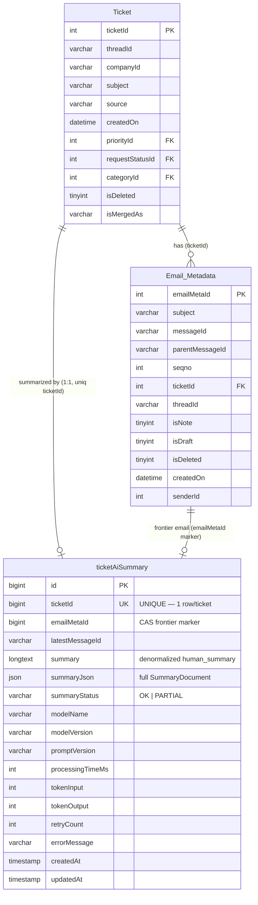
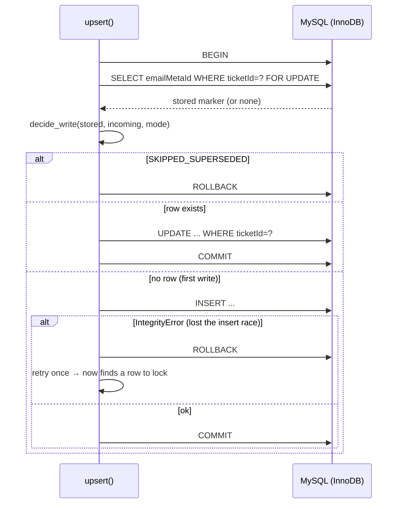

# 06 — Database

- [1. Overview](#1-overview)
- [2. ER diagram](#2-er-diagram)
- [3. Tables](#3-tables)
- [4. The write target: `ticketAiSummary`](#4-the-write-target-ticketaisummary)
- [5. Compare-and-set (CAS) write strategy](#5-compare-and-set-cas-write-strategy)
- [6. Concurrency & locking](#6-concurrency--locking)
- [7. Indexes & constraints](#7-indexes--constraints)
- [8. Migrations](#8-migrations)

---

## 1. Overview

- **Engine:** MySQL 8.0 (`utf8mb4` / `utf8mb4_0900_ai_ci`), on AWS RDS.
- **Database:** `TrackEaseV2DB` (the host Stepping Desk product's DB — this worker is a
  tenant of an existing schema, not the owner).
- **Driver:** PyMySQL, one connection per call via a shared factory.
- This worker touches **three** tables: it **reads** `Email_Metadata` (and, conceptually,
  `Ticket`), and **reads/writes** `ticketAiSummary`. It does not modify `Ticket` or
  `Email_Metadata`.

The DDL for `Email_Metadata` and `Ticket` below is transcribed from
[`CLAUDE.md`](../CLAUDE.md) (the maintained schema record); the `ticketAiSummary` DDL is
additionally corroborated by the integration test's `_DDL`
([test_mysql_summary_repository_integration.py:47-70](../tests/integration/persistence/test_mysql_summary_repository_integration.py#L47-L70)),
and the columns this worker actually writes are corroborated by the `INSERT`/`UPDATE` SQL in
[`mysql_summary_repository.py`](../src/summarizer/adapters/persistence/mysql_summary_repository.py#L41-L72).

## 2. ER diagram



## 3. Tables

### `Email_Metadata` (read-only here)
One row per email/note on a ticket. The worker's enumeration query:
```sql
SELECT emailMetaId, messageId, isNote, threadId
FROM Email_Metadata
WHERE ticketId = %s AND isDraft = 0 AND isDeleted = 0
ORDER BY emailMetaId ASC
```
([mysql_email_metadata.py:23-30](../src/summarizer/adapters/email/mysql_email_metadata.py#L23-L30)).
Key columns for this worker: `emailMetaId` (ordering + frontier), `messageId` (fallback id),
`isNote` (labelled `[Internal Note]` in the prompt), `threadId` (Email API lookup key),
`isDraft`/`isDeleted` (filters). Has index `idx_em_ticket_draft_deleted_meta
(ticketId, isDraft, isDeleted)` — well-aligned with the query's `WHERE` + `ORDER BY`.

### `Ticket` (contextual, not queried by this worker)
The parent ticket. Notable: `isMergedAs` implies merge/split semantics exist, but **merges
of existing tickets are not supported** (splits create independent new tickets). This is
load-bearing for CAS correctness — if merge support is ever added, the frontier-monotonicity
assumption must be revisited. The dropdown FK columns (`priorityId`, `categoryId`,
`requestTypeId`, …) are the columns a *future* human-in-the-loop step could populate from the
LLM's advisory `classification` — but **this worker never writes them** (advisory-only).

### `ticketAiSummary` (read/write)
The output table — one row per ticket (`UNIQUE ticketId`).

## 4. The write target: `ticketAiSummary`

Columns the worker writes (from `_params` +
[`_INSERT_SQL`/`_UPDATE_SQL`](../src/summarizer/adapters/persistence/mysql_summary_repository.py#L41-L72)):

| Column | Source | Meaning |
|--------|--------|---------|
| `ticketId` | command | ticket key (UNIQUE) |
| `emailMetaId` | CAS marker | **frontier** — newest email reflected |
| `latestMessageId` | fetched `RawEmail.message_id` | provenance |
| `summary` | `document.content.human_summary` | denormalized for cheap UI reads |
| `summaryJson` | `document.model_dump_json()` | full versioned `SummaryDocument` |
| `summaryStatus` | `write.status` | `OK` \| `PARTIAL` only |
| `modelName` / `modelVersion` | LLM client | which model produced it |
| `promptVersion` | prompt builder | which elicitation |
| `processingTimeMs`, `tokenInput`, `tokenOutput`, `retryCount` | run metrics | observability |
| `errorMessage` | optional | present on partials/notes |
| `createdAt` / `updatedAt` | DB defaults | timestamps |

Every row is **self-describing** — `schema_version` (inside `summaryJson`), `promptVersion`,
`modelName`/`modelVersion` together make any stored summary fully interpretable and
reproducible in isolation. This is what enables a future embedding/RAG build to **replay
from the table** without needing historical events.

## 5. Compare-and-set (CAS) write strategy

The core correctness mechanism. `emailMetaId` is *both* the FK to the frontier email *and*
the CAS marker — no separate timestamp needed. The pure decision logic
([`decide_write`](../src/summarizer/adapters/persistence/mysql_summary_repository.py#L81-L103)):

| Mode | Condition | Outcome | New frontier |
|------|-----------|---------|--------------|
| `APPEND_ONLY` | no stored row, or `incoming > stored` | `WRITTEN` | `incoming` |
| `APPEND_ONLY` | `incoming <= stored` | `SKIPPED_SUPERSEDED` | unchanged |
| `REPROCESS` | always | `WRITTEN` (force content) | `max(stored, incoming)` |

Two invariants this encodes:
1. **The frontier never regresses** — even a deliberate `REPROCESS` of an older snapshot uses
   `max(stored, incoming)`.
2. **DLQ redrives use `APPEND_ONLY`, never `REPROCESS`.** A message that sat in the DLQ may
   carry a since-superseded marker; force-overwriting would clobber a newer summary. The
   integration test `test_dlq_redrive_of_superseded_message_is_a_safe_no_op` proves this
   end-to-end ([L174-189](../tests/integration/persistence/test_mysql_summary_repository_integration.py#L174-L189)).



## 6. Concurrency & locking

- **Same ticket, existing row:** `SELECT ... FOR UPDATE` locks the row (via the `UNIQUE
  ticketId` index) so concurrent writers serialize; other tickets are unaffected.
- **Same ticket, brand-new (no row yet):** nothing to lock, so multiple `INSERT`s can race.
  Exactly one wins; the rest get a duplicate-key `IntegrityError`, roll back, and retry
  **once** — the second attempt finds a row and blocks on the winner's lock. One retry is
  provably sufficient regardless of how many writers race
  (`test_two_concurrent_first_writes_converge_on_the_higher_marker`).
- **Why not `INSERT ... ON DUPLICATE KEY UPDATE`?** Deliberately rejected for an unambiguous,
  auditable `WriteOutcome` — that construct has notoriously quirky affected-rows semantics.
  The extra round-trip is irrelevant at this volume.

## 7. Indexes & constraints

| Table | Constraint / index | Role for this worker |
|-------|--------------------|----------------------|
| `ticketAiSummary` | `PRIMARY KEY (id)` | surrogate key |
| `ticketAiSummary` | `UNIQUE KEY uniq_ticketId (ticketId)` | enforces one-row-per-ticket; the lock target for CAS; the collision that triggers the insert-race retry |
| `ticketAiSummary` | `KEY idxTicketId (ticketId)` | frontier lookups |
| `Email_Metadata` | `KEY idx_em_ticket_draft_deleted_meta (ticketId, isDraft, isDeleted)` | serves the enumeration query's filter + order |
| `Email_Metadata` | `PRIMARY KEY (emailMetaId)` | ordering + frontier marker |

## 8. Migrations

**There is no migration framework in this repo** — no Alembic, no Flyway, no `migrations/`
directory (verified across the tree). Schema changes to shared staging infra have been
applied manually and recorded in `CLAUDE.md`, e.g.:

- `ALTER TABLE ticketAiSummary ADD COLUMN summaryJson JSON DEFAULT NULL` — the live table was
  missing this column; added manually (user-approved) during the first real run.
- `emailMetaId` already existed on the live table (confirmed, no migration needed).

**Implication (technical debt):** because the schema is managed out-of-band, the code's
expected shape and the live table can drift silently — this has *already happened twice*
(missing `summaryJson`, missing identifiers on the Email API). The integration test's `_DDL`
is the closest thing to a canonical schema definition for `ticketAiSummary` and should be
treated as the reference. See [10 — Technical Debt](10-technical-debt.md).
