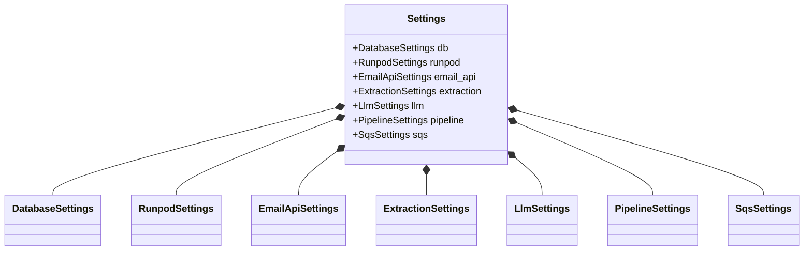
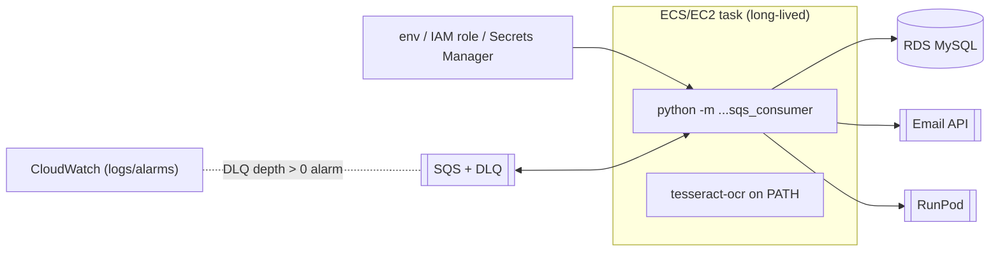

# 08 — Technology Stack, Configuration, Build & Deployment

- [1. Technology stack](#1-technology-stack)
- [2. Environment variables](#2-environment-variables)
- [3. Configuration model](#3-configuration-model)
- [4. Build system](#4-build-system)
- [5. Deployment strategy](#5-deployment-strategy)
- [6. Performance](#6-performance)
- [7. Scalability](#7-scalability)

---

## 1. Technology stack

Runtime language: **Python 3.12** (`.python-version` = `3.12`; `requires-python = ">=3.12"`).

### Runtime dependencies ([pyproject.toml:7-21](../pyproject.toml#L7-L21))

| Library                      | Purpose                                                                   | Where used                       | Notable alternative                                                 |
| ---------------------------- | ------------------------------------------------------------------------- | -------------------------------- | ------------------------------------------------------------------- |
| **pydantic** ≥2.13           | Schema definition + validation; source of the guided-decoding JSON schema | `domain/schema/v1.py`, validator | attrs + cerberus (no schema-export)                                 |
| **pydantic-settings** ≥2.9   | Env→typed settings                                                        | `config/settings.py`             | dynaconf, plain `os.environ`                                        |
| **pymysql** ≥1.2             | Pure-Python MySQL driver (no C toolchain — matters on Windows dev)        | both MySQL adapters              | mysqlclient (C), SQLAlchemy (ORM overkill here)                     |
| **python-dotenv** ≥1.1       | Load `.env` into `os.environ`                                             | `settings.py`                    | env-file support in pydantic-settings (per-class caveat, see below) |
| **requests** ≥2.32           | HTTP client                                                               | Email API + RunPod clients       | httpx (async), urllib3                                              |
| **PyMuPDF** ≥1.25            | PDF text extraction                                                       | `handlers.extract_pdf`           | pdfplumber, pypdf                                                   |
| **python-docx** ≥1.1         | DOCX text + XXE-safe parser                                               | `handlers.extract_docx`          | docx2txt                                                            |
| **openpyxl** ≥3.1            | XLSX read (read-only, data-only)                                          | `handlers.extract_xlsx`          | pandas (heavy)                                                      |
| **email-reply-parser** ≥0.5  | Strip quoted reply chains                                                 | normalizer                       | custom regex (kept as fallback)                                     |
| **tiktoken** ≥0.9            | Token estimation for budgeting                                            | prompt builder                   | HF tokenizers, heuristic char/4                                     |
| **pytesseract** + **Pillow** | Image OCR + image loading/bomb guard                                      | `handlers.extract_image`         | a vision LLM (rejected: 2nd endpoint)                               |
| **boto3** ≥1.35              | AWS SQS client                                                            | `sqs_consumer`                   | aioboto3, raw AWS REST                                              |

### Dev / tooling dependencies ([pyproject.toml:27-35](../pyproject.toml#L27-L35))

| Tool                                                     | Role                                                  |
| -------------------------------------------------------- | ----------------------------------------------------- |
| **mypy** ≥2.2 (`strict = true`, `pydantic.mypy` plugin)  | Static typing gate                                    |
| **ruff** ≥0.15 (rules `E,F,I,UP,B,SIM`, line-length 100) | Lint + import sort                                    |
| **pytest** ≥9.1 + **pytest-cov**                         | Test runner; `integration` marker excluded by default |
| **testcontainers[mysql]** ≥4.14                          | Spin real MySQL 8.0 for integration tests             |
| **types-pymysql**                                        | Type stubs for PyMySQL                                |

### External runtime services (not pip deps)

- **Tesseract OCR engine** — a _system_ package (`apt-get install tesseract-ocr`), **not**
  provided by `uv sync`. Must be on the worker image's `PATH` or every image attachment
  degrades to `FAILED`.
- **RunPod Serverless / worker-vllm v2.14.0**, **MySQL 8.0 (RDS)**, **AWS SQS**, the
  **internal Email API**.

## 2. Environment variables

Loaded via `.env` (dev) or the process environment (prod). Sub-settings each use an
`env_prefix` ([settings.py](../src/summarizer/config/settings.py)). **Required** = no default,
process fails at startup if missing.

| Variable                             | Prefix group | Required? | Default                                                   | Purpose / security note                                |
| ------------------------------------ | ------------ | --------- | --------------------------------------------------------- | ------------------------------------------------------ |
| `DB_HOST`                            | Database     | **yes**   | —                                                         | RDS host                                               |
| `DB_PORT`                            | Database     | no        | `3306`                                                    |                                                        |
| `DB_USER`                            | Database     | **yes**   | —                                                         | DB user                                                |
| `DB_PASSWORD`                        | Database     | **yes**   | —                                                         | 🔒 secret                                              |
| `DB_NAME`                            | Database     | **yes**   | —                                                         | `TrackEaseV2DB`                                        |
| `RUNPOD_ENDPOINT_ID`                 | Runpod       | **yes**   | —                                                         | endpoint id in the URL                                 |
| `RUNPOD_API_KEY`                     | Runpod       | **yes**   | —                                                         | 🔒 Bearer token                                        |
| `EMAIL_API_BASE_URL`                 | EmailApi     | no        | `https://maildata.stage.steppingdesk.com/api/getMailBody` | staging default                                        |
| `EMAIL_API_TIMEOUT_SECONDS`          | EmailApi     | no        | `30`                                                      |                                                        |
| `EXTRACTION_MAX_FILE_BYTES`          | Extraction   | no        | `10485760`                                                | 10 MB cap                                              |
| `EXTRACTION_TIMEOUT_SECONDS`         | Extraction   | no        | `30`                                                      | wall-clock per file                                    |
| `EXTRACTION_MAX_DECOMPRESSION_RATIO` | Extraction   | no        | `100`                                                     | zip-bomb cap                                           |
| `EXTRACTION_MAX_XLSX_ROWS`           | Extraction   | no        | `50000`                                                   |                                                        |
| `EXTRACTION_MAX_XLSX_CELLS`          | Extraction   | no        | `500000`                                                  |                                                        |
| `LLM_MODEL_NAME`                     | Llm          | no        | `qwen/qwen2.5-7b-instruct`                                | **must match** `/v1/models` exactly (case-sensitive)   |
| `LLM_MODEL_VERSION`                  | Llm          | no        | `2.5`                                                     | provenance                                             |
| `LLM_MAX_CONTEXT_TOKENS`             | Llm          | no        | `32768`                                                   | confirmed via `/v1/models`                             |
| `LLM_MAX_OUTPUT_TOKENS`              | Llm          | no        | `2048`                                                    | reserved from budget                                   |
| `LLM_TEMPERATURE`                    | Llm          | no        | `0.0`                                                     | deterministic                                          |
| `LLM_TOP_P`                          | Llm          | no        | `1.0`                                                     |                                                        |
| `LLM_REPETITION_PENALTY`             | Llm          | no        | `1.05`                                                    |                                                        |
| `LLM_REQUEST_TIMEOUT_SECONDS`        | Llm          | no        | `300`                                                     | ⚠️ see debt: client default is 600 but this (300) wins |
| `PIPELINE_LLM_VALIDATION_RETRIES`    | Pipeline     | no        | `3`                                                       | app-level retries                                      |
| `PIPELINE_EMAIL_FETCH_CONCURRENCY`   | Pipeline     | no        | `5`                                                       | fetch pool size                                        |
| `PIPELINE_PROMPT_VERSION`            | Pipeline     | no        | `v1`                                                      | selects template folder + provenance label             |
| `SQS_QUEUE_URL`                      | Sqs          | **yes**   | —                                                         | the live queue                                         |
| `SQS_MAX_MESSAGES`                   | Sqs          | no        | `10`                                                      | batch size                                             |
| `SQS_WAIT_TIME_SECONDS`              | Sqs          | no        | `20`                                                      | long-poll                                              |
| `SQS_VISIBILITY_TIMEOUT`             | Sqs          | no        | `120`                                                     | floor; heartbeat extends it                            |
| `SQS_HEARTBEAT_MARGIN_SECONDS`       | Sqs          | no        | `30`                                                      | re-extend this early                                   |
| `SQS_CONCURRENCY`                    | Sqs          | no        | `3`                                                       | consumer thread pool                                   |
| `AWS_ACCESS_KEY_ID`                  | (boto3)      | **yes**\* | —                                                         | 🔒 read by boto3 default chain                         |
| `AWS_SECRET_ACCESS_KEY`              | (boto3)      | **yes**\* | —                                                         | 🔒                                                     |
| `AWS_DEFAULT_REGION`                 | (boto3)      | **yes**\* | —                                                         | e.g. `ap-south-1`                                      |

\* AWS vars are consumed by boto3's own credential chain, not by a settings class. In
production these should be an **IAM role**, not static keys.

## 3. Configuration model



**Load-order gotcha (documented in code):** each sub-settings class is instantiated via its
own `Field(default_factory=...)`, and pydantic-settings' `env_file` loading is _per class_ —
so nested sub-settings would only see OS env vars, not `.env`. The fix is an explicit
`load_dotenv()` at import time ([settings.py:8-24](../src/summarizer/config/settings.py#L8-L24))
that populates `os.environ` once, up front, so every sub-settings class sees the same values.
This was a real bug that only surfaced on the first `.env`-only run.

## 4. Build system

- **Package/dependency manager:** `uv`. Lockfile: `uv.lock`.
- **Build backend:** `uv_build` ([pyproject.toml:23-25](../pyproject.toml#L23-L25)).
- **Package layout:** src-layout (`src/summarizer/`), PEP 561 typed (`py.typed`).
- **There is no bundler/compiler/transpiler** — it's Python; "build" = dependency resolution
  - wheel build. No webpack/vite/tsc (no frontend).
- **Quality gates** (run locally / should be CI):
  ```bash
  uv run pytest            # 213 unit tests (integration excluded by default)
  uv run mypy --strict src # 0 errors across 35 files
  uv run ruff check src    # clean
  ```

## 5. Deployment strategy

- **Compute:** ECS/Fargate or EC2 (Lambda explicitly ruled out — the worker is CPU/IO-bound
  with long attachment-parsing + LLM durations that don't fit Lambda well).
- **Process:** run `python -m summarizer.entrypoints.sqs_consumer` as a long-lived process.
  It installs SIGINT/SIGTERM handlers for **graceful shutdown** (drains the current batch,
  then exits 0 — [sqs_consumer.py:255-275](../src/summarizer/entrypoints/sqs_consumer.py#L255-L275)),
  which suits container orchestration.
- **Image must include** the `tesseract-ocr` system package (OCR won't work otherwise).
- **Scaling signal (inferred):** `ApproximateNumberOfMessagesVisible` on the queue.
- **Backfill:** a separate DB-driven script (`entrypoints/backfill.py`) is planned but not
  built; it would reuse the same orchestrator, relying on CAS for idempotent resumability.



**Status (from `CLAUDE.md`):** the SQS consumer is built and unit-tested but **not yet run
against the live queue** — verify one real message end-to-end before cutting production
traffic onto it.

## 6. Performance

Observed real-run numbers (from `CLAUDE.md` real-infra runs): ~10s for a small 3-email
ticket; ~88s and ~198s for larger threads — dominated by LLM inference + cold starts.

Optimizations actually present in code:

| Technique                                                                  | Where              |
| -------------------------------------------------------------------------- | ------------------ |
| Bounded-concurrency email fetch (5 workers)                                | `_fetch_all`       |
| RYW-gate fetch reused (no double-fetch of triggering email)                | `_fetch_all` cache |
| Token budgeting to avoid oversized (slow/failing) prompts                  | prompt builder     |
| Thread normalization removes O(n²) duplicated quote chains                 | normalizer         |
| Early supersede-skip avoids all fetching/inference for stale events        | orchestrator guard |
| `deterministic` inference (`temperature=0`) → reproducible, cache-friendly | LLM settings       |
| Connection-per-call (no long-held connections)                             | MySQL adapters     |

**Not present:** no result caching (each event re-summarizes the whole thread — a deliberate
"no incremental summarization" decision at current volume), no connection pooling (factory
opens per call — fine at <100/day).

## 7. Scalability

**Current limits & bottlenecks:**

1. **Single shared RunPod GPU** is the hard bottleneck — hence `SQS_CONCURRENCY=3` and no
   push for higher parallelism. This is the throughput ceiling.
2. **Connection-per-call** to MySQL is simple but would need pooling at higher volume.
3. **No horizontal-scaling coordination needed** — CAS makes multiple worker instances safe
   to run concurrently (they can't corrupt each other's writes), so horizontal scaling is
   _available for free_; the GPU is what actually gates it.

**Scaling levers:**

- _Horizontal:_ run N consumer tasks against the same queue (safe via CAS + visibility
  timeouts). Gains are capped by RunPod capacity.
- _Vertical:_ more RunPod workers / a bigger GPU tier; raise `SQS_CONCURRENCY` in step.
- _Future:_ the deferred backfill script's own bounded concurrency protects live traffic from
  the 40k backfill without a second queue.
