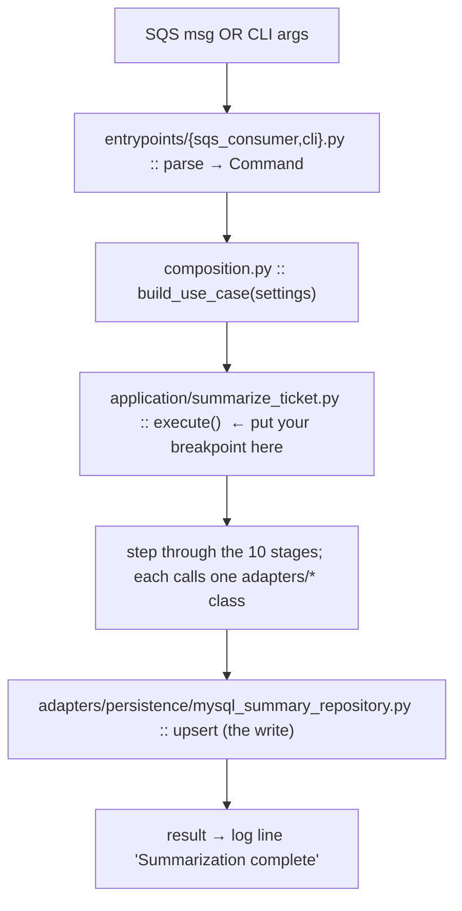

# 09 — Engineering Onboarding Guide & Coding Standards

- [1. Prerequisites](#1-prerequisites)
- [2. Install](#2-install)
- [3. Run](#3-run)
- [4. Test, type-check, lint](#4-test-type-check-lint)
- [5. Debug](#5-debug)
- [6. How to trace a request](#6-how-to-trace-a-request)
- [7. Where important code lives](#7-where-important-code-lives)
- [8. How to add / change things](#8-how-to-add--change-things)
- [9. Coding standards & conventions](#9-coding-standards--conventions)
- [10. Common pitfalls](#10-common-pitfalls)

---

## 1. Prerequisites

- **Python 3.12** (see `.python-version`).
- **[uv](https://docs.astral.sh/uv/)** — the package manager & runner.
- For image OCR locally: **Tesseract** installed (on Windows the handler auto-probes
  `C:\Program Files\Tesseract-OCR\...`). Without it, image attachments degrade to `FAILED` —
  the rest of the pipeline still works.
- For integration tests only: **Docker** (testcontainers spins MySQL 8.0).
- A `.env` file with the variables listed in [08 — Deployment §2](08-deployment.md#2-environment-variables).

## 2. Install

```bash
uv sync                 # resolve + install runtime and dev deps from uv.lock
```

Create your `.env` (never commit it). Minimum required keys: `DB_*`, `RUNPOD_*`,
`SQS_QUEUE_URL`, `AWS_*`. Everything else has sane defaults.

## 3. Run

**Single ticket (manual — the normal way to exercise the pipeline):**
```bash
uv run python -m summarizer.entrypoints.cli \
  --ticket-id 239908 --email-meta-id 134049 --thread-id "18fecd7164264ab8"
```
Add `--reprocess` to force-overwrite an existing summary (administrative only). `--thread-id`
is a **short hex string**, not a Message-ID.

**Live consumer (long-running):**
```bash
uv run python -m summarizer.entrypoints.sqs_consumer
```
Ctrl-C / SIGTERM triggers a clean drain-and-exit.

## 4. Test, type-check, lint

```bash
uv run pytest              # 213 unit tests; integration excluded by default
uv run pytest -m integration   # requires Docker (MySQL testcontainer)
uv run mypy --strict src   # must be clean
uv run ruff check src      # must be clean (ruff also sorts imports)
```
All three gates are currently green. Treat them as required before any commit.

## 5. Debug

- **Logs are JSON, one object per line** on stdout. Filter by `ticket_id` to follow one run.
- Each stage logs a milestone (fetching email, prompt built, retrying validation, completion
  summary with `write_outcome`/`status`/timings/tokens).
- To debug **without** hitting real infra, write a small script that constructs
  `SummarizeTicket` with **fake ports** (copy the pattern from
  [`tests/unit/application/test_summarize_ticket.py`](../tests/unit/application/test_summarize_ticket.py)) —
  every dependency is a `Protocol`, so this is trivial.
- To debug **one adapter** against real infra, call it directly (e.g. instantiate
  `HttpEmailGateway` and `fetch_email(...)`) — this is exactly how the historical
  contract-change bugs were diagnosed.
- Common failure signatures: a fast ~1.3s RunPod `500` → model-name casing mismatch; a 300s
  timeout → RunPod worker stuck initializing; `200 []`/empty result → Email-not-yet-available
  (RYW) or an identifier mismatch.

## 6. How to trace a request



The orchestrator's `execute()` is the one place to understand the whole flow; from there each
line delegates to exactly one adapter you can open next.

## 7. Where important code lives

| I want to… | Go to |
|------------|-------|
| Understand the whole flow | [`application/summarize_ticket.py`](../src/summarizer/application/summarize_ticket.py) |
| Change what the LLM is asked | [`adapters/prompt/templates/v1/system.txt`](../src/summarizer/adapters/prompt/templates/v1/system.txt) (or v2) |
| Change the output schema | [`domain/schema/v1.py`](../src/summarizer/domain/schema/v1.py) |
| Change the write/CAS rules | [`adapters/persistence/mysql_summary_repository.py`](../src/summarizer/adapters/persistence/mysql_summary_repository.py) (`decide_write`) |
| Change email fetching | [`adapters/email/http_email_gateway.py`](../src/summarizer/adapters/email/http_email_gateway.py) |
| Change attachment handling | [`adapters/extraction/`](../src/summarizer/adapters/extraction/) |
| Change thread cleaning | [`adapters/normalize/normalizer.py`](../src/summarizer/adapters/normalize/normalizer.py) |
| Swap an implementation | [`composition.py`](../src/summarizer/composition.py) |
| Add a config knob | [`config/settings.py`](../src/summarizer/config/settings.py) |
| Change queue behaviour | [`entrypoints/sqs_consumer.py`](../src/summarizer/entrypoints/sqs_consumer.py) |

## 8. How to add / change things

**Add a new attachment format:** add a handler in `handlers.py`, register its MIME(s) in
`_EXTRACTABLE_MIMES` and a branch in `_dispatch` (extractor.py). Add a unit test. The
extractor already guarantees never-raise, so just raise on failure inside the handler.

**Add a new LLM-produced field:** add it to `LlmSummaryOutput` (nullable/defaulted unless
truly always-present), update the system template's field guidance, bump `promptVersion` if
elicitation changed. The guided-decoding schema updates automatically from the model.

**Add a new prompt version:** create `templates/v<N>/system.txt`, set
`PIPELINE_PROMPT_VERSION=v<N>`. Unknown versions fall back to v1's template while still
recording the label. (v2 already exists — it elicits `classification`; the default stays `v1`
until v2's real-ticket output has been eyeballed.)

**Swap an adapter (e.g. a different LLM):** implement the port's `Protocol`, wire it in
`composition.py`. Nothing else changes — no orchestrator edits.

**Golden rule:** business logic goes in `application/`, I/O goes in an adapter behind a port,
data shapes go in `domain/`. Entrypoints stay thin. Concretes are named only in
`composition.py`.

## 9. Coding standards & conventions

_Inferred from the consistent style across all 35 source files:_

- **Typing:** full annotations everywhere; `mypy --strict` is mandatory. `from __future__
  import annotations` at the top of most modules.
- **Immutability:** domain carriers are `@dataclass(frozen=True, slots=True)`; Pydantic models
  for validated data.
- **Enums:** `StrEnum` for anything persisted or serialized (readable in JSON/DB).
- **Naming:** modules & functions `snake_case`; classes `PascalCase`; private helpers and
  module constants prefixed `_`; adapters named `<Tech><Role>` (`MySqlSummaryRepository`,
  `HttpEmailGateway`, `RunpodVllmClient`).
- **Ports vs adapters:** interface names are role-only (`EmailGateway`); implementations
  prepend the technology.
- **Errors:** raise the narrowest domain error; never swallow unknown exceptions; let real
  bugs propagate.
- **Docstrings carry the "why".** Modules and non-obvious methods explain rationale and cite
  dated decisions — match this density when editing.
- **Guard clauses / early returns** over nested conditionals.
- **Comments cite decisions** (`# confirmed live 2026-07-13`, `# see CLAUDE.md`). Keep this —
  it's the project's institutional memory.
- **Tests:** unit tests use hand-written fakes for ports (no mocking framework); mirror the
  `src/` path; mark infra-dependent tests `@pytest.mark.integration`.
- **Line length 100**; ruff rule sets `E,F,I,UP,B,SIM`.

## 10. Common pitfalls

1. **`.env` and nested settings** — remember `load_dotenv()` runs at import; don't remove it
   or nested sub-settings stop reading `.env`.
2. **`--thread-id` is a hex string, not a Message-ID.** Passing a `<...@outlook.com>` value
   makes the Email API fail to resolve the S3 key (500).
3. **Model-name casing** — `LLM_MODEL_NAME` must exactly match `GET /openai/v1/models`
   (lowercase). A mismatch is a silent generic 500, not a clean error.
4. **Tesseract not installed** → image attachments are `FAILED` (summary becomes `PARTIAL`),
   not a crash. Fine locally; must be fixed on the deploy image.
5. **Never route a DLQ redrive through `--reprocess`/`REPROCESS`.** It could clobber a newer
   summary. Redrives must use `APPEND_ONLY`.
6. **Integration tests need Docker** and are excluded by default — running `uv run pytest`
   green does **not** mean the concurrency/locking behaviour was exercised.
7. **The prompt-logging debug block** (prompt_builder.py:101-111) will spam full email bodies
   into your logs — remove it (see [technical debt T1](10-technical-debt.md#t1)).
8. **Schema drift** — the live MySQL table is managed out-of-band; confirm columns exist
   before assuming (this has bitten the project twice).
