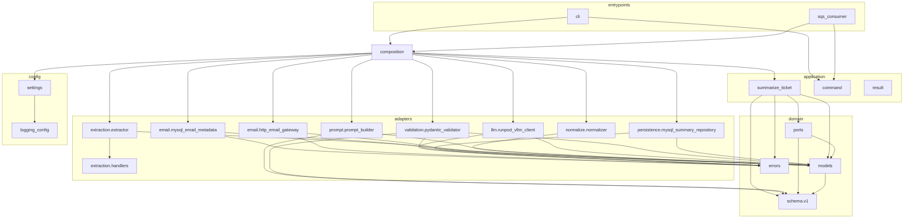
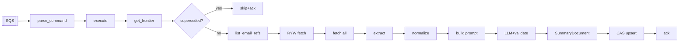
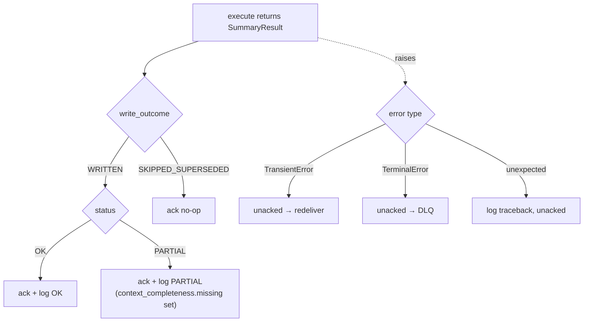

# 10 — Technical Debt, Future Improvements & Appendix

- [1. Technical debt (ranked)](#1-technical-debt-ranked)
- [2. Code smells & minor issues](#2-code-smells--minor-issues)
- [3. Future improvements](#3-future-improvements)
- [4. Architecture Decision summary (ADR-style)](#4-architecture-decision-summary-adr-style)
- [5. Appendix — diagrams & trees](#5-appendix--diagrams--trees)

---

## 1. Technical debt (ranked)

Severity reflects production risk, not effort.

### <a id="t1"></a>T1 — 🔴 High: full prompt (email bodies + attachments) logged at INFO
**Where:** [prompt_builder.py:101-111](../src/summarizer/adapters/prompt/prompt_builder.py#L101-L111).
A leftover debug block (`###########`) logs the entire assembled prompt — full customer email
bodies and extracted attachment text — on every run, defeating the logging allow-list's
anti-leak design. **Also technically a correctness smell:** it constructs a throwaway `Prompt`
object just to log it.
**Fix:** delete lines 101-111. Zero behavioral impact. *(This is the highest-value single
change in the codebase.)*

### T2 — 🟠 Medium: LLM request-timeout inconsistency (intended change didn't take effect)
**Where:** [settings.py:83](../src/summarizer/config/settings.py#L83) (`= 300`) vs
[runpod_vllm_client.py:56](../src/summarizer/adapters/llm/runpod_vllm_client.py#L56) (`= 600`).
The recent commit *"changed the timeout from 300 to 600 sec"* changed only the **client
constructor default (600)**, but `composition.py` always passes
`settings.llm.request_timeout_seconds` (**300**), so the effective timeout is still **300s**.
The two defaults now disagree and the intended change is inert.
**Fix:** decide the real value and set it in `settings.py` (the one that wins); align the
client default to match to avoid future confusion.

### T3 — 🟠 Medium: schema managed out-of-band (drift risk, already realized twice)
No migration framework; the live MySQL schema is altered manually. This has already caused two
production-blocking drifts (missing `summaryJson` column; Email API identifier changes).
**Fix:** adopt a lightweight migration tool (Alembic or plain versioned SQL scripts in
`migrations/`), and/or a startup schema-assertion check. Treat the integration test `_DDL` as
the canonical `ticketAiSummary` definition.

### T4 — 🟠 Medium: no CI pipeline
Gates (`pytest`/`mypy`/`ruff`) run only on-demand locally. A regression can land unnoticed.
**Fix:** add GitHub Actions (or equivalent) running the three gates on every PR; run
integration tests on a Docker-enabled runner.

### T5 — 🟠 Medium: integration tests never executed; SQS consumer never run live
The CAS concurrency/locking tests require Docker (absent in the dev sandbox), and the SQS
consumer has never processed a real queue message (per `CLAUDE.md`). Both are the parts most
likely to behave differently under real conditions.
**Fix:** run `uv run pytest -m integration` in CI; smoke-test one real SQS message before
cutting production traffic.

### T6 — 🟡 Low–Med: in-process attachment "sandbox"
The extraction sandbox is resource-capped but runs in-process (thread timeout, not a
process/container boundary). A runaway native parser could exceed the wall-clock cap.
**Fix (if the corpus becomes less trusted):** move extraction to a subprocess with hard
limits, or a separate container.

### T7 — 🟡 Low: Email API "not-yet-available" signalling unconfirmed
`_unwrap_envelope` defensively handles both HTTP 404 and a body-level `status` for the RYW
gate because the real behaviour isn't confirmed on staging
([http_email_gateway.py:24-28](../src/summarizer/adapters/email/http_email_gateway.py#L24-L28)).
**Fix:** confirm against a real not-yet-available ticket, then simplify to the real path.

### T8 — 🟡 Low: repo-root clutter of historical/scratch files
`CONTEXT.txt`, `new_context.txt`, `summarizer.txt`, `test_cli.txt`,
`engineering_status.md.pdf`, `runpod_context.py`, `SQS_Pipeline_context.js`,
`choices_context.json`, and an empty (now populated) README lived at the repo root. They're
design history/reference, not code, and obscure the actual project.
**Fix:** move to a `docs/history/` or `reference/` folder (or delete once captured here).

## 2. Code smells & minor issues

| Smell | Where | Note |
|-------|-------|------|
| Duplicated magic constants | `ExtractionSettings` defaults vs `SandboxedExtractor.__init__` defaults | Two sources of truth; can drift. Low risk (composition passes settings). |
| Duplicated `_TRANSIENT_MYSQL_ERROR_CODES` | both MySQL adapters | Could live in one shared spot. |
| `SummaryPersistenceTransient` reused by the **email-metadata** adapter | mysql_email_metadata.py:16,62 | Slight naming mismatch — it's not "summary persistence." Cosmetic. |
| `AttachmentRef.text_summary` never populated | schema/v1.py:176 | Reserved field; attachment text goes into the prompt, not this field. Intentional, worth a comment. |
| `if/elif` dispatch in `_dispatch` | extractor.py:167-186 | Fine as-is (xlsx needs extra args); a table would add indirection. |
| v2 prompt built but unused by default | `PIPELINE_PROMPT_VERSION=v1` | Deliberate — awaiting real-ticket validation. Not debt, just status. |
| No dead code / no commented-out blocks | — | The codebase is otherwise clean; `_pii_mask` is an intentional documented hook, not dead code. |

> Note: a previously-present lint issue (unsorted import block in `handlers.py`) was fixed
> during this engagement; `ruff` is now clean.

## 3. Future improvements

**Architecture**
- Implement the deferred **transactional outbox / `SummaryUpserted`** as a decorator around
  `SummaryRepository` when embeddings become a requirement (the seam already exists).
- Consider **connection pooling** if volume grows past the current per-call model.

**Developer experience**
- CI (T4), a `.env.example` (S1), a `Dockerfile` + IaC, and a `Makefile`/`justfile` for the
  three gates + run commands.
- Move history files out of the root (T8).

**Testing**
- Execute integration tests in CI (T5); add an end-to-end test with all ports faked exercising
  `PARTIAL` and retry-exhaustion paths (largely covered already — 213 tests).

**Monitoring**
- Emit real metrics (CloudWatch/Prometheus): processing time, token usage, `PARTIAL` rate,
  retry rate, DLQ depth alarm. Today these exist only as log fields.

**Security** (see [07](07-security.md))
- Remove prompt-logging leak (T1/S2), rotate + externalize secrets (S1), consider subprocess
  sandbox (T6).

**Product/quality**
- Validate prompt **v2** classification output against real tickets, then flip the default.
- Resolve the deferred `current_status` vs real ticket-status vocabulary reconciliation.
- Decide the R6 open question: whether a permanently-missing non-triggering email should
  degrade to `PARTIAL` instead of blocking a ticket indefinitely.

## 4. Architecture Decision summary (ADR-style)

| # | Decision | Rationale | Status |
|---|----------|-----------|--------|
| AD-1 | Hexagonal + Clean Architecture | Swappable I/O; testable core | Implemented |
| AD-2 | `emailMetaId` as CAS frontier marker | Idempotent, order-independent, backfill-resumable | Implemented |
| AD-3 | Standard (not FIFO) SQS + DB CAS | CAS makes ordering unnecessary | Implemented |
| AD-4 | `APPEND_ONLY` vs `REPROCESS` as an enum | Makes the DLQ-redrive foot-gun unrepresentable | Implemented |
| AD-5 | Provenance split (`LlmSummaryOutput` vs `SummaryDocument`) | Model can't fake grounding/system facts | Implemented |
| AD-6 | Guided JSON decoding + Pydantic validation | Schema-conformant output, retry on violation | Implemented |
| AD-7 | Full re-summarization (no incremental) | Simplicity at <100 tickets/day | Implemented |
| AD-8 | Truncation order: attachments then oldest emails | Preserve recent conversation over attachment text | Implemented |
| AD-9 | Local OCR (pytesseract) not a vision LLM | Avoid a 2nd RunPod endpoint | Implemented (needs system Tesseract) |
| AD-10 | Self-hosted LLM ⇒ defer pre-inference PII masking | No 3rd-party exfiltration risk | Deferred (hook exists) |
| AD-11 | No backfill queue; a DB-driven script instead | CAS already gives idempotent resumability | Planned (script unbuilt) |
| AD-12 | Embeddings/RAG as a repository decorator, no outbox in Phase 1 | Replay from table later | Deferred (seam exists) |
| AD-13 | PyMySQL + hand-written SQL (no ORM) | Precise `FOR UPDATE`/CAS control; no C toolchain | Implemented |
| AD-14 | Visibility heartbeat thread | Survive slow RunPod cold starts without redelivery | Implemented |

## 5. Appendix — diagrams & trees

### 5.1 Directory tree (source of truth)

```
STP CLD Summarizerinator/
├── README.md                     ← doc index (this deliverable)
├── docs/                         ← this documentation set (01–10)
├── CLAUDE.md                     ← authoritative maintained design record
├── CONTEXT.txt / new_context.txt ← raw design history (reference)
├── choices_context.json          ← dropdown vocab snapshot (classification source)
├── runpod_context.py / SQS_Pipeline_context.js ← unrelated-project reference snippets
├── pyproject.toml / uv.lock      ← deps, tooling config, build backend
├── .env                          ← secrets (gitignored, untracked)
├── .python-version               ← 3.12
└── src/summarizer/
    ├── domain/          models.py · errors.py · ports.py · schema/v1.py
    ├── application/     summarize_ticket.py · command.py · result.py
    ├── adapters/        email/ · extraction/ · normalize/ · prompt/ · llm/ · validation/ · persistence/
    ├── config/          settings.py · logging_config.py
    ├── entrypoints/     cli.py · sqs_consumer.py   (backfill.py planned)
    ├── composition.py
    └── py.typed
tests/  unit/<mirrors src> · integration/persistence/ · (fixtures)
```

### 5.2 Full module dependency graph



### 5.3 Request flow (compact)



### 5.4 Response / outcome flow



### 5.5 Index of every Mermaid diagram in this doc set

| Diagram | Doc |
|---------|-----|
| System context flowchart | [README](../README.md) |
| Live workflow journey; CLI usage | [01](01-overview.md) |
| Hexagonal layers; ports classDiagram; component diagram; dependency graph | [02](02-architecture.md) |
| Event dispatch; data-flow; request sequence; CAS state; status stateDiagram; data lifecycle | [03](03-pipeline-and-data-flow.md) |
| Extraction decision flow; error-hierarchy classDiagram | [04](04-backend.md) |
| Integration map | [05](05-api.md) |
| ER diagram; CAS write sequence | [06](06-database.md) |
| (findings tables) | [07](07-security.md) |
| Settings classDiagram; deployment diagram | [08](08-deployment.md) |
| Request-trace flowchart | [09](09-onboarding.md) |
| Module dependency graph; request/response flow | [10](10-technical-debt.md) (this doc) |
